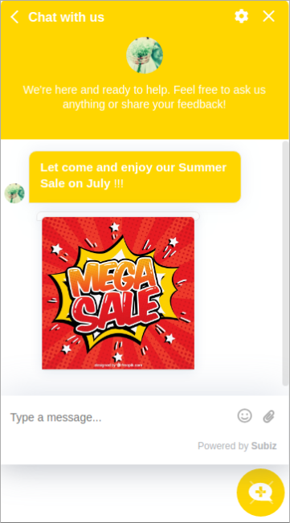
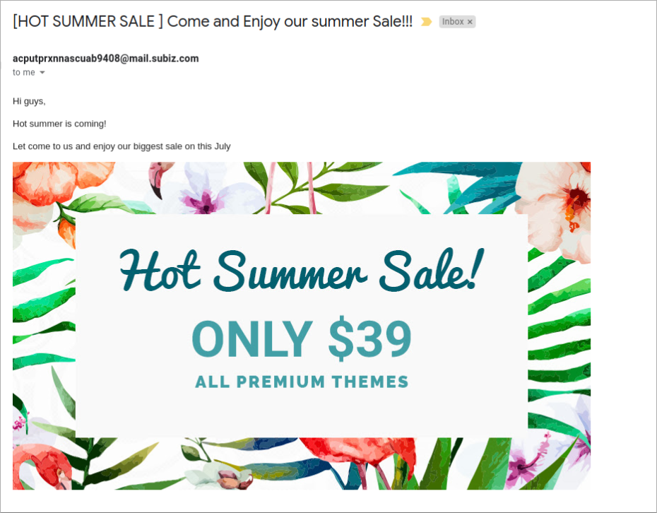
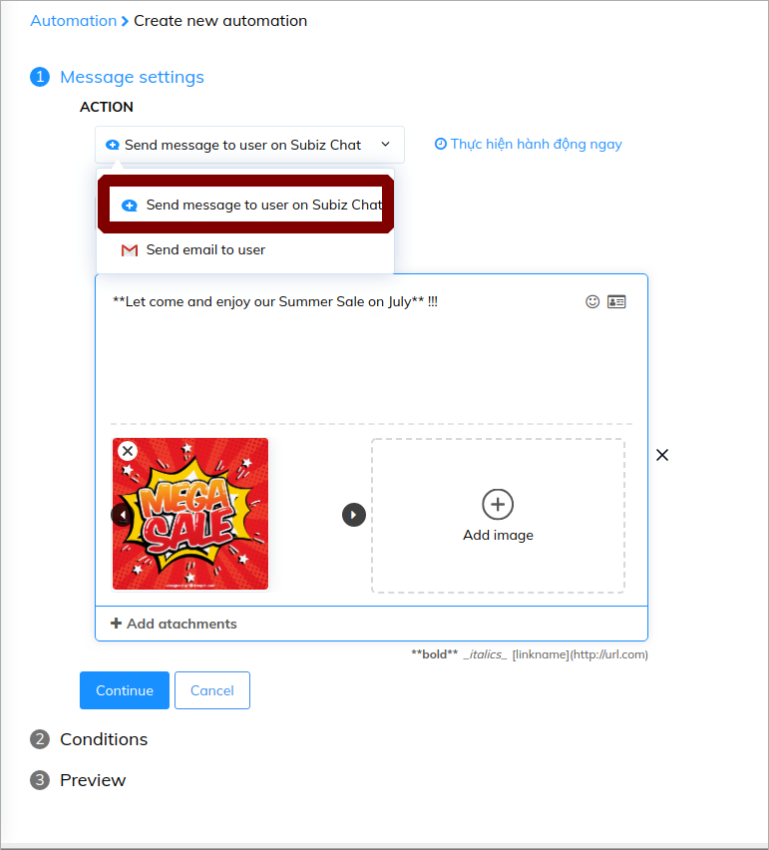
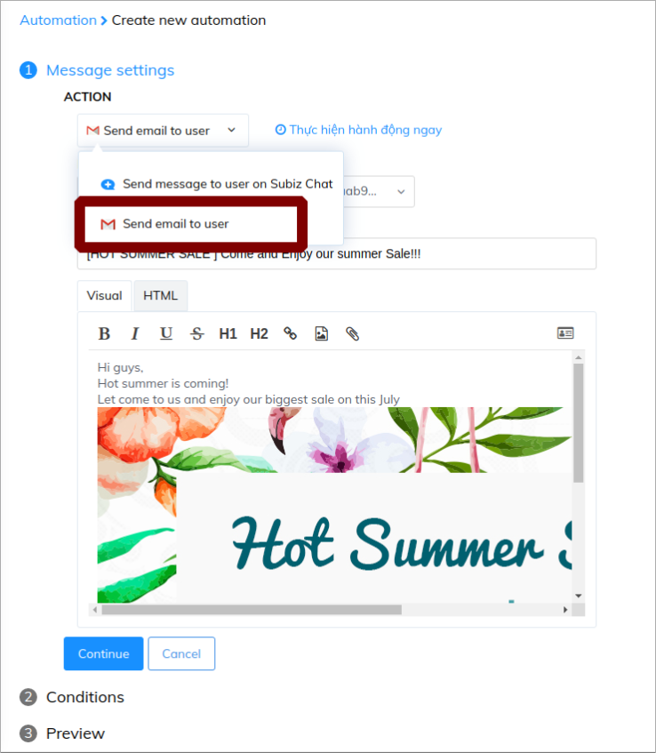
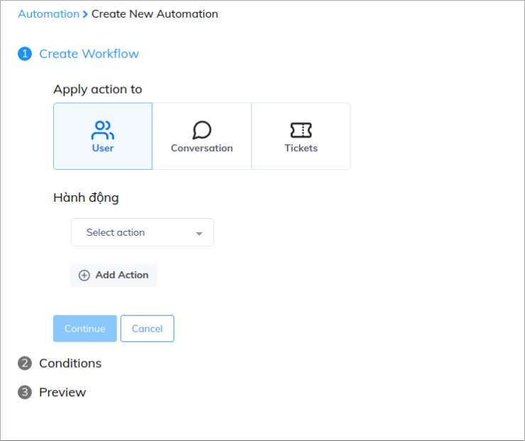
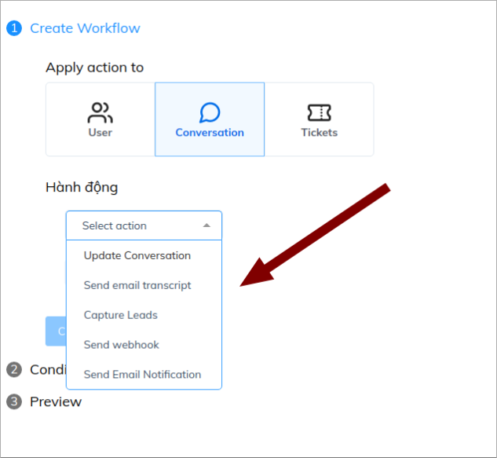
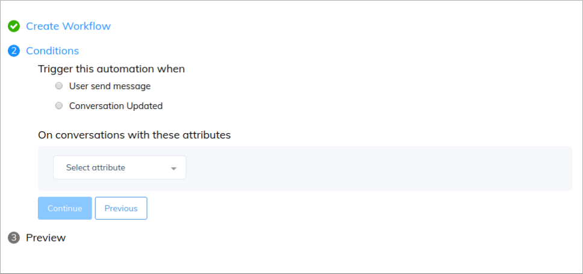
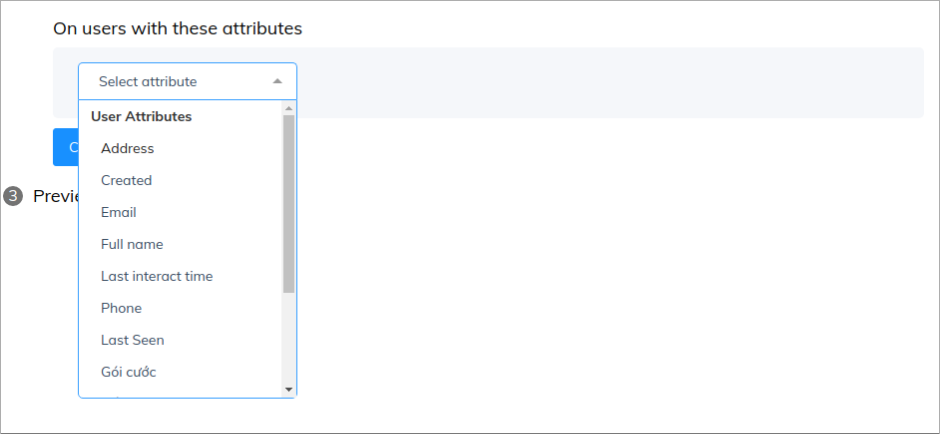
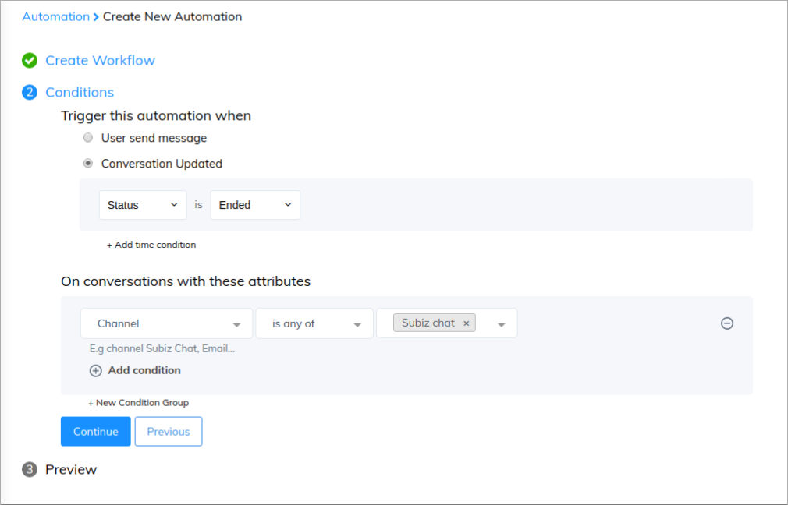
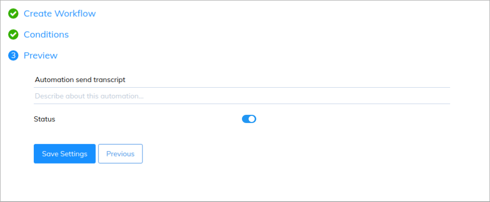

# Overview of Automation

### What is Automation?

Automation is an automatic interaction that is set up to attract customers' attention as soon as visitors come to the website, collect information and automatically pursue customers through channels on Subiz.

Based on the customers data and the ways you want to take care of your customers, you can set up many different automation actions. Thereby,  you can operate your business automatically but still reach high efficiency.

You can start with creating Automation to send promotional information to customers visiting the website: 

Moreover, you can also apply Automation to send emails to your potential customers:

### Types of Automation

You can set up 2 types of Automation concluding: **Creating conversation** and **Workflows**

* **Create conversation:** This Automation will be set up for proactive actions to reach customers such as: Send automatic greeting messages or automatic emails to customers.
* **Workflows:** This Automation will be set up  for automatic processes. For example: capture leads, send email transcripts...

### Setting Automation

To set up an Automation, you need to complete 3 compulsory steps including: Create action, set up condition and save name. 

#### Step 1: Create Action 

1. _**Create conversation:**_ \( [`Click here`](https://app.subiz.com/settings/automations/add-conversation) \)

In this kind of Automation, you can select action to send message or send email to users

* Automation send message

* Automation send email

_**2. Create Workflows**_ \( [`Click here`](https://app.subiz.com/settings/automation-workflow) \) 

Firstly, you have to select the object to apply automation to including: **User**, **Conversation** and **Tickets**. 

Then, you set up the action for your automation:

You can read more about automation object and actions here:

<table>
  <thead>
    <tr>
      <th style="text-align:left">Object</th>
      <th style="text-align:left"><b>Actions</b>
      </th>
      <th style="text-align:left">How to use</th>
      <th style="text-align:left">Example</th>
    </tr>
  </thead>
  <tbody>
    <tr>
      <td style="text-align:left"><b>User</b>
      </td>
      <td style="text-align:left"></td>
      <td style="text-align:left"></td>
      <td style="text-align:left"></td>
    </tr>
    <tr>
      <td style="text-align:left"></td>
      <td style="text-align:left">Send email notification</td>
      <td style="text-align:left">Send email notification when users visit a page or update their name,
        email, phones.</td>
      <td style="text-align:left">Send email to agent when users update their phone number</td>
    </tr>
    <tr>
      <td style="text-align:left"></td>
      <td style="text-align:left">Send webhook</td>
      <td style="text-align:left">Send user data on Subiz to CRM system</td>
      <td style="text-align:left">Send user data on Subiz to CRM</td>
    </tr>
    <tr>
      <td style="text-align:left"></td>
      <td style="text-align:left">Update user</td>
      <td style="text-align:left">Update users info when their action satisfy a condition.</td>
      <td style="text-align:left">Update a user as potential when he chat from Price page</td>
    </tr>
    <tr>
      <td style="text-align:left"><b>Conversation</b>
      </td>
      <td style="text-align:left"></td>
      <td style="text-align:left"></td>
      <td style="text-align:left"></td>
    </tr>
    <tr>
      <td style="text-align:left"></td>
      <td style="text-align:left">Update Conversation</td>
      <td style="text-align:left">Update a conversation by adding tag, adding agents or changing status
        when it satisfy a condition</td>
      <td style="text-align:left">Adding tag &quot; Asking price &quot; to a conversation when user chat
        from Price Page</td>
    </tr>
    <tr>
      <td style="text-align:left"></td>
      <td style="text-align:left">Send Email transcript</td>
      <td style="text-align:left">Auto send email transcript to email</td>
      <td style="text-align:left">Send email transcript when a conversation ends on Subiz</td>
    </tr>
    <tr>
      <td style="text-align:left"></td>
      <td style="text-align:left">Capture leads</td>
      <td style="text-align:left">Ask users information right after their first message.</td>
      <td style="text-align:left">Ask users information on Subiz chat channel.</td>
    </tr>
    <tr>
      <td style="text-align:left"></td>
      <td style="text-align:left">Send Email notification</td>
      <td style="text-align:left">Send email notification to agent when a conversation is updated by adding
        tags, agent or changing status.</td>
      <td style="text-align:left">Send email notification to agent when adding Tag &quot; Potentials &quot;
        to a conversation</td>
    </tr>
    <tr>
      <td style="text-align:left"></td>
      <td style="text-align:left">
        
Send

        
webhook

      </td>
      <td style="text-align:left">Send conversation data to CRM</td>
      <td style="text-align:left">Send data of conversations on Subiz Chat to CRM</td>
    </tr>
    <tr>
      <td style="text-align:left"><b>Ticket</b>
      </td>
      <td style="text-align:left"></td>
      <td style="text-align:left"></td>
      <td style="text-align:left"></td>
    </tr>
    <tr>
      <td style="text-align:left"></td>
      <td style="text-align:left">Update Ticket</td>
      <td style="text-align:left">Auto update Ticket for a conversation</td>
      <td style="text-align:left">Update a Ticket on Open status and Priority at &quot; High&quot; to a
        conversation with tag &quot; Complaint&quot;</td>
    </tr>
    <tr>
      <td style="text-align:left"></td>
      <td style="text-align:left">Send webhook</td>
      <td style="text-align:left">Send ticket to CRM</td>
      <td style="text-align:left">Send ticket on Subiz chat to CRM</td>
    </tr>
    <tr>
      <td style="text-align:left"></td>
      <td style="text-align:left">Send Email notification</td>
      <td style="text-align:left">Send email notification to agent when ticket is updated.</td>
      <td style="text-align:left">Send email to agent when a ticket is updated &quot; Open &quot;</td>
    </tr>
  </tbody>
</table>After setting Action, you click " **Continue** " to the next step

#### Step 2: Setting Condition

You have to set up condition so that your automation can run. 

There are two types of conditions that you you need to notice:

* _**Trigger this automation when**_: This is a compulsory condition that you need to set up to make sure your automation will run.

For example: Send automation message when visitors come to Subiz.com

* _**On Users with these Attributes**_ : You do not need to set up this condition. It is used to add more information about users so that you can narrow the object receive automation.

For example: Send email transcript of an ended conversation on Subiz chat

You can read more about Condition here: 

<table>
  <thead>
    <tr>
      <th style="text-align:left"></th>
      <th style="text-align:left"><b>Conditions</b>
      </th>
      <th style="text-align:left">How to use</th>
      <th style="text-align:left">Example</th>
    </tr>
  </thead>
  <tbody>
    <tr>
      <td style="text-align:left"><b>Trigger this automation </b>
      </td>
      <td style="text-align:left">&lt;b&gt;&lt;/b&gt;</td>
      <td style="text-align:left"></td>
      <td style="text-align:left"></td>
    </tr>
    <tr>
      <td style="text-align:left"></td>
      <td style="text-align:left">User view page</td>
      <td style="text-align:left">When visitor come to websites or a specific link.</td>
      <td style="text-align:left">Send message to users visit Subiz.com:
         Page URL- contains -Subiz.com</td>
    </tr>
    <tr>
      <td style="text-align:left"></td>
      <td style="text-align:left">Page title</td>
      <td style="text-align:left">Websites often create page titles related to a certain topic. With each
        t you can put an automation to support and guide customers in time.</td>
      <td
      style="text-align:left">
        
Send message to users visit page title &quot; Camera&quot;:

        
Page title - contains - camera

        </td>
    </tr>
    <tr>
      <td style="text-align:left"></td>
      <td style="text-align:left">Channel</td>
      <td style="text-align:left">Based on the channel of conversation: Subiz chat, Messenger, Email.</td>
      <td
      style="text-align:left">
        
Send capture leads to conversations on Subiz chat:

        
Channel - is any of- Subiz Chat

        </td>
    </tr>
    <tr>
      <td style="text-align:left"></td>
      <td style="text-align:left">Channel Source</td>
      <td style="text-align:left">Based on the channel source such as fanpage, email</td>
      <td style="text-align:left">
        
Send email transcript of conversation on Fanpage:

        
Channel Source - is any of - Subiz

      </td>
    </tr>
    <tr>
      <td style="text-align:left"></td>
      <td style="text-align:left">Ticket updated</td>
      <td style="text-align:left">Based on the status or priority of tickets.</td>
      <td style="text-align:left">
        
Send email notification to agents when a ticked is updated at &quot; high
          &quot; priority:

        
Priority - is any of - high

      </td>
    </tr>
    <tr>
      <td style="text-align:left"></td>
      <td style="text-align:left">Conversation updated</td>
      <td style="text-align:left">
        
Wen a conversation is updated by:

        <ul>
          <li>Adding status:</li>
          <li>Adding Agents</li>
          <li>Adding Tags</li>
        </ul>
        

      </td>
      <td style="text-align:left">
        <ul>
          <li>Send email transcript of ended conversation:
             Status - is -</li>
          <li>Send email transcript of a conversation when adding agents: Add agent
            - is any of - Linh Le</li>
          <li>Send email transcript of a conversations when adding Tag &quot; Price
            &quot;. Add Tag - is any of - Price</li>
        </ul>
      </td>
    </tr>
    <tr>
      <td style="text-align:left"></td>
      <td style="text-align:left">User attribute updated</td>
      <td style="text-align:left">When users update their attributes</td>
      <td style="text-align:left">Send email notifications to agent when users update their phone number:
         Phone - not empty
         
      </td>
    </tr>
    <tr>
      <td style="text-align:left"><b>On Users with these attributes    </b>
      </td>
      <td style="text-align:left">&lt;b&gt;&lt;/b&gt;</td>
      <td style="text-align:left"></td>
      <td style="text-align:left"></td>
    </tr>
    <tr>
      <td style="text-align:left"></td>
      <td style="text-align:left">Attributes</td>
      <td style="text-align:left">When Users update their attributes ( full name, phone, email...)</td>
      <td
      style="text-align:left">
        
Send email transcript of an ended conversation on Subiz chat:
           Status - is - ended

        
Channel - is any of - Subiz Chat

        </td>
    </tr>
    <tr>
      <td style="text-align:left"></td>
      <td style="text-align:left">Trace</td>
      <td style="text-align:left">
        
Based on the Users&apos; traces ( IP, country code, City)

        
Note:

        <ul>
          <li><a href="https://countrycode.org/">List of City Code </a>: You can click
            to country to find city code</li>
        </ul>
      </td>
      <td style="text-align:left">
        
Send email transcript of an ended conversation of users from Hanoi:

        
Status - is - ended

        
City - is - Hanoi

      </td>
    </tr>
  </tbody>
</table>After finishing this step, you can continue to the last step

#### Step 3: Save Automation

 

