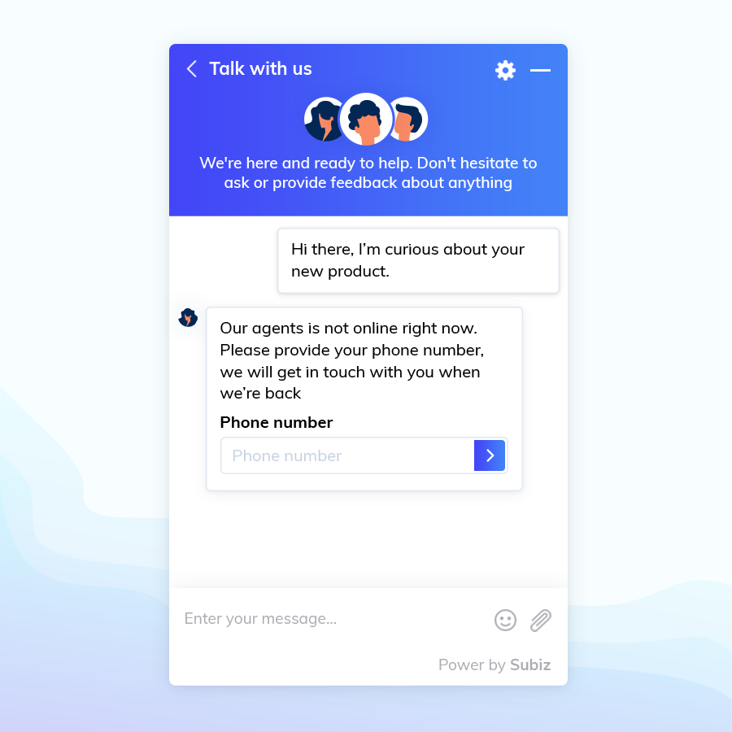
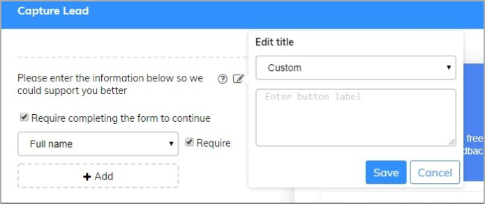
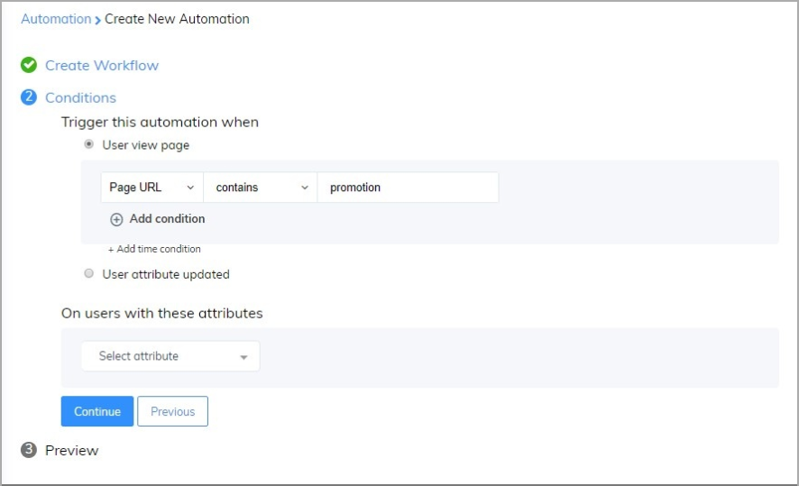
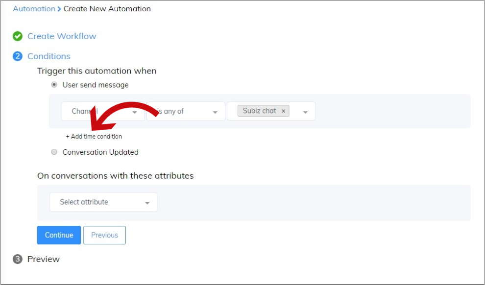
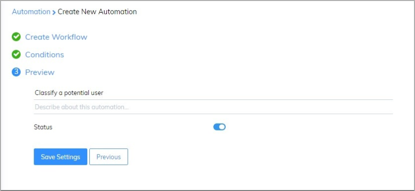
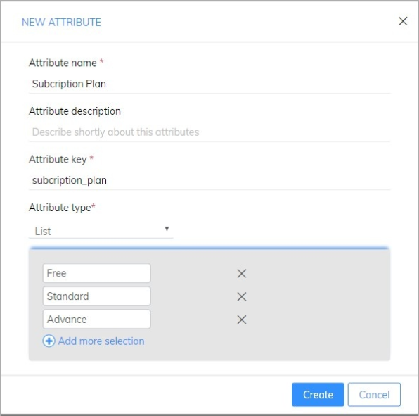
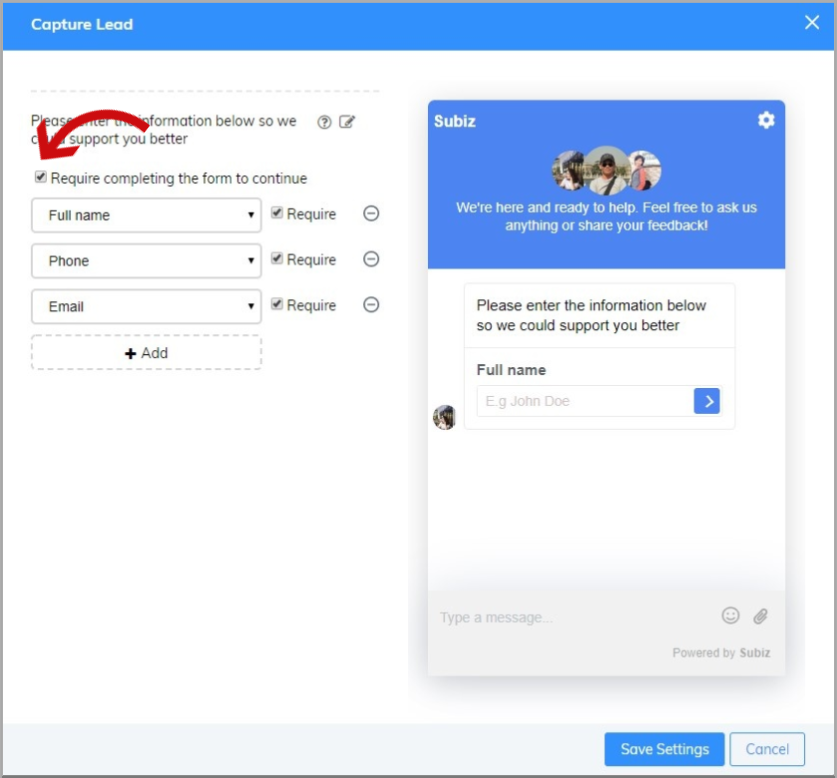

# Capture Leads

Potential customers are people who interest in products and services that you provide. Subiz will help you identify, collect and store potential customer information with powerful features Capture leads - Ask user information.

### How will Capture Leads work? 

Capture Leads will be displayed after the first user message. 

Example: Send Automation to ask for information when users chat via the website.

### Setup Capture Leads

Sign in [App.subiz.com -&gt; Setting -&gt; Account -&gt; Automation -&gt; Work follow -&gt; Create](https://app.subiz.com/settings/automation-workflow).

You will follow 3 steps as below:

#### Step 1: Create Work follow

After choosing Apply action to conversation and action Capture Leads, you could edit content of form for your own.

**Note:** If you want to edit the message content, you can click on the edit button to change.

After completing the setup the message content of Capture leads, click Continue to move to the next step.

#### Step 2: Setup Conditions

There are 2 conditions you have to consider: 

* **Trigger this automation when:** This is a mandatory condition you have to set up. Automation will run when the conversation meets the established condition. 

For example: Send Automation to ask for information when users chat via the website.

In case you want to choose the time frame to ask for users information, you can choose to Add time conditions:

* On conversations with these attributes: This condition is not uncessary. This is an additional condition, allowing you to select specific objects to send capture leads. 

After finish set up the condition, click **Continue** to go to the last step.

#### Step 3: Give a name to Automation 

You fill the Automation name and add description about Automation, then Save settings.

### Notes 

* User Attribute \([Details](https://help-en.subiz.com/optimise-the-use-of-subiz/managing-data/users-attributes)\) 

Beyond the default information fields: Name, Phone number, Email, Address. You can add new attribute depending on your business user information needs:

[Settings -&gt; Account -&gt; User Attribute](https://app.subiz.com/settings/user-attributes) -&gt; New Attribute

* You can either force user fill information before chat or not.

In order to customize the settings Capture leads according to the working time of the business, you could refer via this link.

