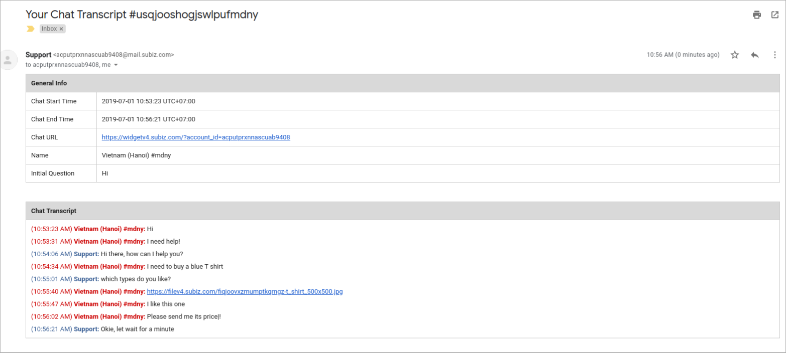

# Email Transcript

Customer data and interaction history are important information to businesses. In addition to helping businesses keep data on a solid system , Subiz also has function to automatically send conversation transcript to Agent's email. You can experience this feature by applying Automation email transcript.

Example:  This is an email transcript sample that you can receive after chatting with customers on Subiz.

### Setting Automation Send Email Transcript

Log in [App.subiz.com &gt; Setting &gt; Account &gt; Automation &gt; Workflow](https://app.subiz.com/settings/automation-workflow)

You have to follow 3 steps as follow:

#### **Step 1: Create Workflow**

You select **Conversation** and **Send email transcript**. Then, you can **Edit Content** to select email addresses to send and receive email transcripts:


**Note:** You can add more than 1 email by typing an email address and pressing Enter.


Then, you Click **Continue** to the next step

#### **Step 2: Setting Conditions**

In this part, you should take notice of two kinds of condition.

* **Trigger this automation when :** It is compulsory condition that you have to set up to make sure that your automation will run correctly. Automation will run when a conversation meets the condition.

Example: Send email transcript of conversations on Subiz Chat

* **On conversations with these attributes** : It is not a compulsory condition. In case, you want to add more details on the objects you can use this condition.

Example: Send email transcript of ended conversations on Subiz Chat

After finishing this step, you click **Continue**

#### Step 3: Save Setting

In this step, you create name for the automation and **Save Settings**

###  

