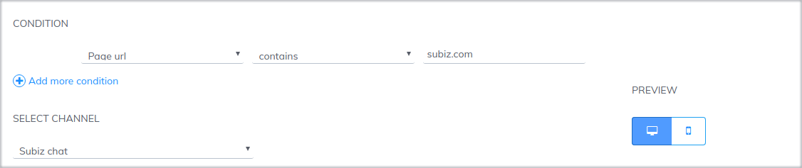
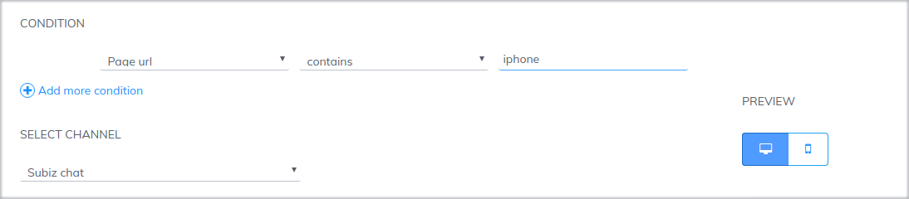
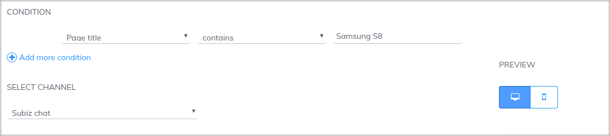
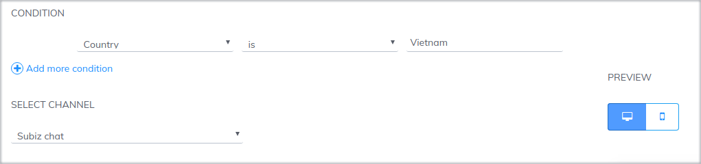
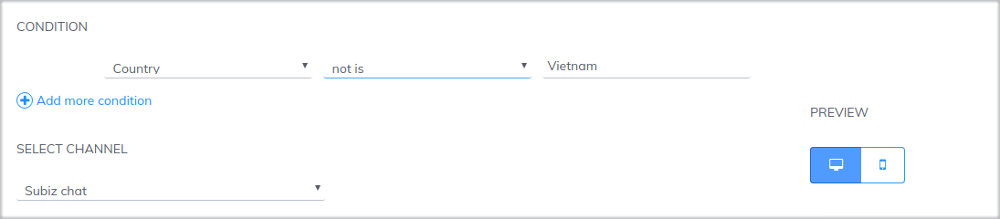
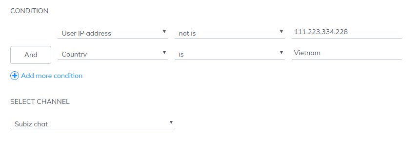

# Sending messages to user automatically

Automation sending a message to visitor via [Subiz Chat](https://subiz.com/live-chat.html) channel is utilized to start a conversation with visitors who meet the automation conditions. This automation can be used as an  automated chat invitation, which allows you to send individual greetings to each customer.

To set up this Automation  you can do as follow:  [**Settings&gt; Account&gt; Automation&gt; Create New Automation**](https://app.subiz.com/settings/automation-list)\*\*\*\*

You can use multiple Automation at the same time to send multiple messages for different purposes. Here are some suggestions for Automation conditions for your convenience.

### Send a message to visitors who view a specific page on website

When new customers visit your website, you need to send them a greeting so that they know your presence and are ready to help them during their shopping.

Example: Page URL - contains - abc.com.vn

### Send a message to visitors who view a specific product on website

If you want to send a promotional message to visitor on a specific product page, or would like to introduce a promotion to your customers on the payment page, you just need to set up Automation according to the page URL of the product 

Or based on the page tittle:

### Send messages to visitors based on geographic area.

Subiz support you to send a specific message to each customer geographically by country. You can use it to send messages in the right language to each customer. For example, for customers from Vietnam, you install the message in Vietnamese.

Condition: Country - is - Vietnam

For foreign customers, you install the message in the English language.

Condition: Country - not is - Vỉetnam

For National and National code conditions, check the standard at https://countrycode.org/. Where: Country Name is displayed in the COUNTRY and Country Code columns in the ISO CODES column, 2-character code area.

For example:

Country - Afghanistan

**Country Code - AF**

### **​**Exclude 1 specific IP address

In case you want to send an automated message to a customer, but do not want to affect the company staff regularly visit to the website to work, you can exclude the internal IP address when sending the message.

Condition: User's IP address - not is -

### Notes for creating Automation sending messages

* You can design [creative automatic messages with Markdown](https://help-en.subiz.com/optimise-the-use-of-subiz/how-to-enhance-interactions/create-automation-message-with-markdown) to draw the attention of your visitors.
* An automation appears only once with 1 visitor. You can create multiple automation to send messages depending on the company's strategy.
* When visitors visit the website, the [Subiz chat](https://subiz.com/live-chat.html) widget will pop up with the automated messages.

If the visitor does not "hide" this[ Subiz](https://subiz.com/en) widget, the next automated message will be announced in numbers, located at the top left of the chat window. When visitors click on that notification message, all messages will be displayed.

If the visitor "hide" the chat window and reads the next pages where you have setted up the automatic message, the message will display as a preview.

  

