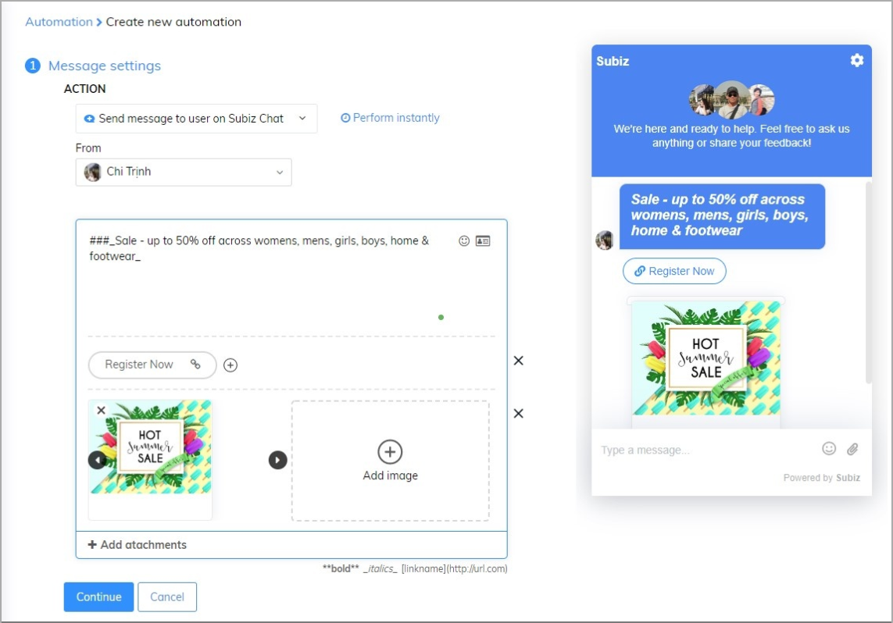

# Sending messages to user automatically

Besides setting up Automation to send automated messages to attract users' attention who access the website to increase the amount of interaction with users, setting up the content of these automated messages is also extremely important. 

A message that clearly, concise, full content with eye-catching design images will impress more than the user. The following article will guide how to use Automation built-in attachment templates so you can attract more interactive users.

### Step 1: Create new automation 

First of all to be able to create automation you need to follow the steps below: [Setting / Account/Automation / Create conversation -> Create](https://app.subiz.com/settings/automations/add-conversation).  
Besides, you could also add attachments to create creative message templates. 

#### Greeting users by name 

For users who have left the information, you create personal experiences when greeting them with the saved name before:

#### Add emoticons in messages 

Adding an emoticon to your message will give your users more exciting experiences when you visit your website and increase their response rate to the message you send. You can add emoticons according to the following example:

#### Capture leads 

You can identify potential users as soon as they visit your website by asking their information:

#### Quick Reply 

By asking questions and providing available answers, you will save time in identifying your users' initial problems and supporting them faster:

#### URL Button 

Creating buttons to call customers and navigate visitors to the site you want will increase your chances of introducing incentive programs and attracting more users:

#### Call Button 

You want uses to call you right on the Subiz chat widget, attaching the phone number link to the Button will help to keep this simple:

#### Attached with images 

Attaching images to messages will create an attraction for your greeting and convey the message you want to customers quickly:

#### Attach file 

This function will help you quickly attach the Quotation, introduce businesses, products to customers: 

### Step 2: Create conditions 

After you have completed the step of creating a message you can continue to step 2: Create Conditions

### Step 3: Save Automation 

Click Continue to go to the last step: Fill the Automation’s name and Save.

