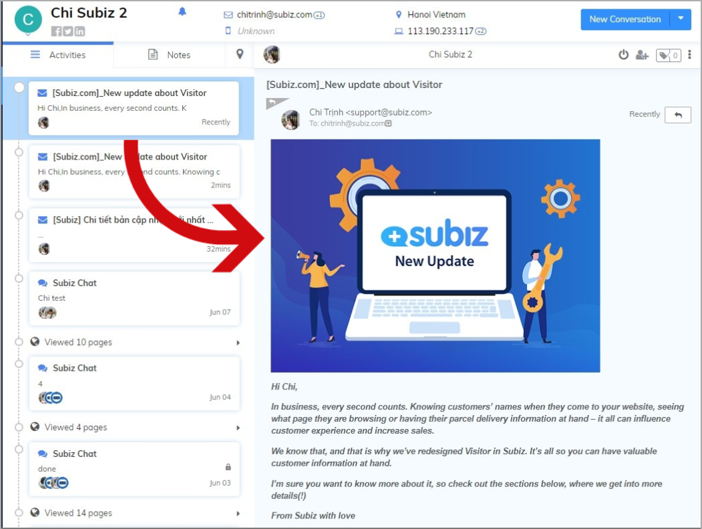
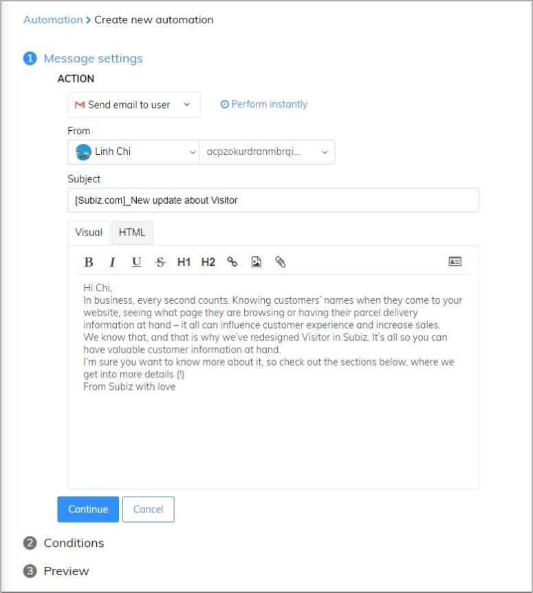
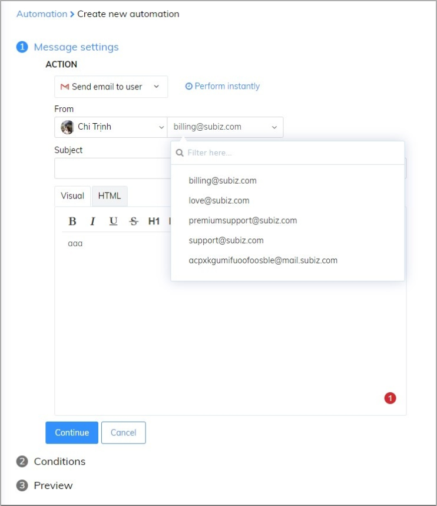
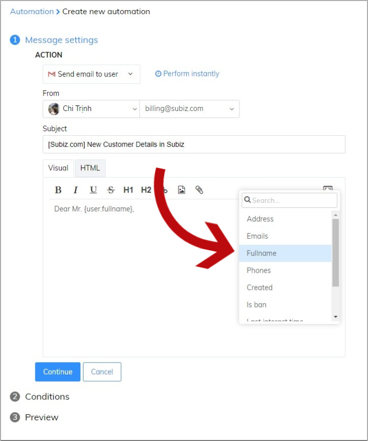
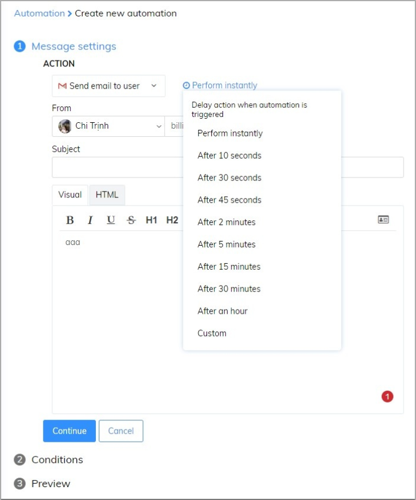
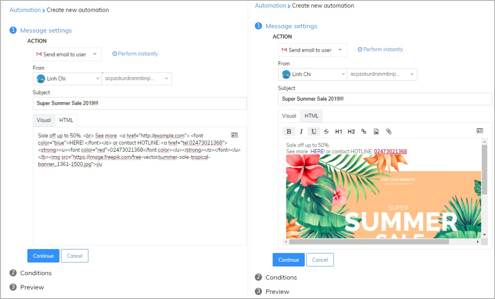
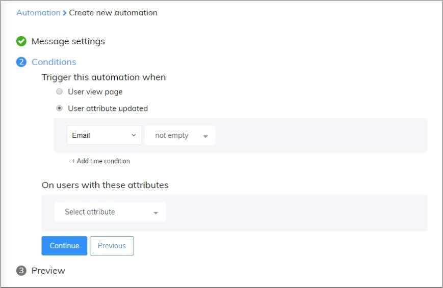
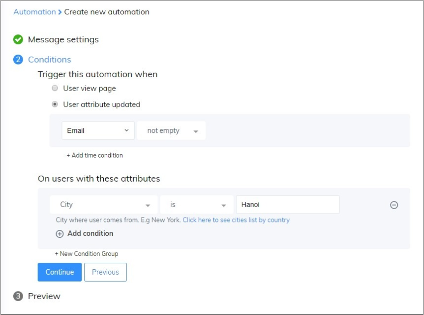
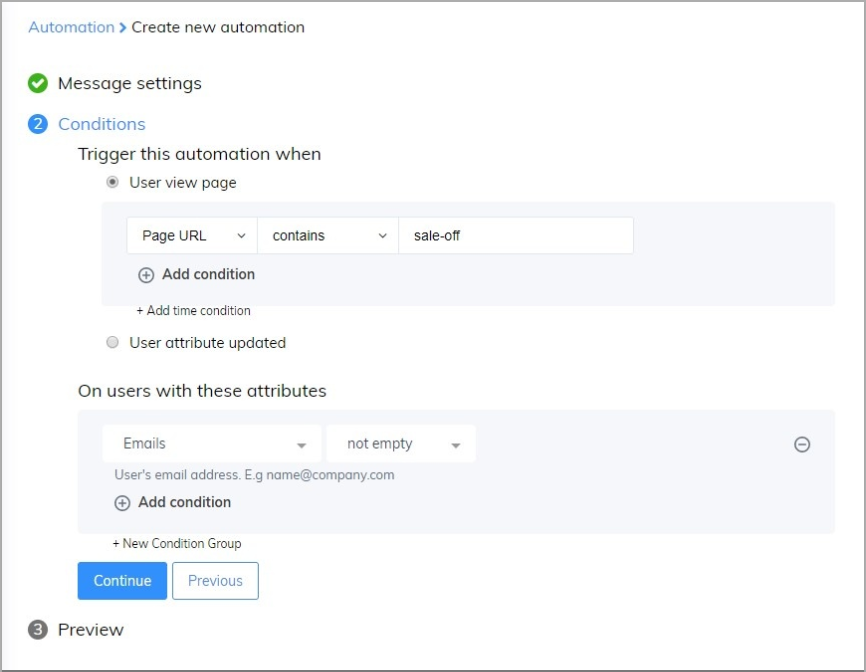

# Automation send email to users

Email gives the great opportunity to re-engage users and increase purchase frequency. You can send emails to build a relationship with users before or after purchasing, promote a product or service, introduce new products, announce incentive programs. 

With Subiz, you can set Email Automation to make it automatic and simple to send emails to the right user.

### How will Email Automation work? 

Email Automation will automatically send emails to the right users immediately after setting. Users  who have email addresses and meet the set-up conditions will receive an email automation.

Example: All users who have email addresses will be sent an email automation for new update.

### Create new Email Automation

Firstly, you have to login [App.subiz.com -&gt; Setting -&gt; Account -&gt; Automation -&gt; Create Conversation -&gt; Create](https://app.subiz.com/settings/automations/add-conversation).

In order to create Automation, please follow 3 steps as below: 

#### Step1: Edit Email Automation content 

**Note:** 

* You could choose an email address that sends an email. However, you have to make sure that email address already installed in Subiz \([See more](https://help-en.subiz.com/getting-started-with-subiz/setting-up-interaction-environments/integrating-email-on-subiz)\).

* You also send an email for each user for their own name if their name saved in Dashboard Subiz.

* In addition, you could set up a time to send Email Automation.

* Moreover, you could create an HTML email for your creation.

#### Step 2: Set up conditions 

You will set up as below:

#### Step 3: Fill the Automation name

### Some common Email Automation 

#### Notification about new product or promotion for a potential user 

You only want to send promotional information for a new user who accesses your website for the first time with conditions.   
For example, you want to send an email to a user who lives in Hanoi, you will set up as below: 

#### Send promotion information for ex-user when they access any page in your website 

The user who had information in your account, you return your website to find sales \(off\) products in the promotion page. You could send them information about a discount or sale \(off\) product to attract them. You could set up an email with the condition as below:

> Do you need help? Just click on [Subiz.com](https://subiz.com/en) and chat with us!

