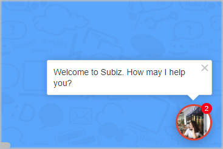

# Sending messages to user automatically

Sending a message to visitor made on Subiz Chat channel. This action will initiate a conversation with a website visitor who satisfies the settled criteria and attaches a message. **Messages automation will be an automated chat invitation as an automated chat invitation, which allows you to send individual greetings to each customer.**

You can use multiple Automation at the same time to send multiple messages for different purposes. Here are some suggestions on Automation installation conditions for your convenience.

### Send a message to visitor who view a specific page on the website

Would you like to send a promotional message to customers on a specific product page, or want to send a promotion to your customers on the payment page? You just only set up Automation according to the URL conditions of the page.

Example: Page URL - contains - http://abc.com.vn

### Send a message to a visitor does not have personal information

For a visitor who do not have personal information on the system, you can send a message along with an invitation to leave personal information so that you can contact again at any time.

### Send messages to customers based on geographic area.

Subiz support you to send a specific message to each customer geographically by country. You can use it to send messages in the right language to each customer. For example, for customers from Vietnam, you install the message in Vietnamese.

Condition: Country code - in - VN

For foreign customers, you install the message in the English language.

Condition: Country code - not - VN

For National and National code conditions, check the standard at https://countrycode.org/. Where: Country Name is displayed in the COUNTRY and Country Code columns in the ISO CODES column, 2-character code area.

For example:

Countries - Afghanistan

**Country Code - AF**

### **​**Exclude 1 specific IP address

In case you want to send an automated message to a customer, but do not want to affect the company staff regularly visit to the website to work, you can exclude the internal IP address when sending the message.

Condition: User's IP address - not -

### Note:  when creating Automation to send messages automatically

* Press Enter to down the line
* When using the URL, system will display the link to the customer click directly
* An automation appears only once with 1 visitor. You can create multiple automation to send messages depending on the company's strategy.
* When visitors visit the website, the Subiz chat widget will pop up with the greetings you have setted.

If the visitor does not "hide" this chat window, the next automated message will be announced in numbers, located at the top left of the chat window. When visitors click on that notification message, all messages will be displayed.

If the visitor "hide" the chat window and reads the next pages where you have setted up the automatic message, the message will display as a preview.

  

