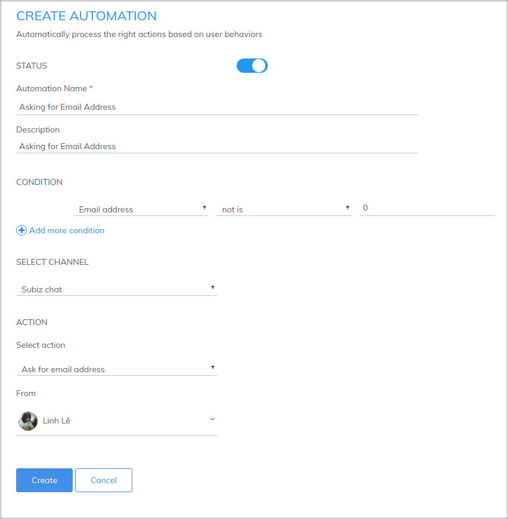

# Asking for email address automatically

Asking the [email](https://subiz.com/email.html) address is an Automation action belonging to the [Subiz Chat](https://subiz.com/live-chat.html) channel. [Email](https://subiz.com/email.html) information enables you to contact customers, identify and classify customers, and conduct [email](https://subiz.com/email.html) automation campaigns.

To set up the form asking for customer information, go to [Settings&gt; Accounts&gt; Automation](https://app.subiz.com/settings/). After naming and describing your management, you should note the following:

### Condition to ask [email](https://subiz.com/email.html) address

You can ask visitors' email address based on a number of Automation conditions such as country, page URL ... Then, the automation will run when the conversation meet the following default conditions:

* The conversation has been going on
* A user does not have [email](https://subiz.com/email.html) address information
* There is a message from this user

Users who do not have email information will receive a message containing the [email](https://subiz.com/email.html) asking form as soon as they send the first message in the [Subiz](https://subiz.com/email.html) window.

### Language to ask for information

* **Vietnamese**

When you select the Vietnamese language for the [Subiz chat](https://subiz.com/live-chat.html) window on your website, the question will be in Vietnamese
: **“Vui lòng nhập địa chỉ email để chúng tôi có thể liên lạc khi bạn cần nhiều sự trợ giúp hơn”**

* **English language**

When you select the English language for the [Subiz](https://subiz.com/live-chat.html) widget on your website, the question will be in English
: **"Please provide an email address so we can contact you when you need our support."**

* **Automatic language**

When you choose Automatic language for the [Subiz](https://subiz.com/en) window on your website,[ Subiz](https://subiz.com/en) automatically identifies your visitors in Vietnam or abroad to display the language of your email in a suitable way. \(The content of question as above\)

* **Customize language**

When you want to customize the language to ask for customer information, you need to do so at the same time as you customize the chat window language. You can customize the language by following the instructions.

### Who will ask?

You need to choose an agent to represent your business to ask for visitors information
.

### Notes for setting up Automation asking for an email address
;

* The action of asking for an [email](https://subiz.com/email.html) address is only made when the conversation is created
* After the customer enters the[ email](https://subiz.com/email.html), the information will be synchronized to the user's data.

 

