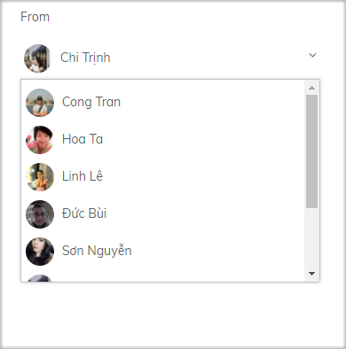

# Asking for email address automatically

Asking the email address is an Automation action belonging to the Subiz Chat channel. Email information enables you to contact customers, identify and classify customers, and conduct email automation campaigns.

To set up the form asking for customer information, go to Settings&gt; Accounts&gt; Automation. After naming and describing your management, you should note the following:

### Condition to ask email address

**You can leave leave the field blank on setting condition**, and then the message asking for the email address will be sent with the **default condition** as follows:

* The conversation has been going on
* A user does not have email address information
* There is a message from a user

Users who do not have email information will receive a message containing the email asking form as soon as they send the message in the Subiz window.

### Language to ask for information

* **Vietnamese**

When you select the Vietnamese language for the Subiz chat window on your website, the question will be in Vietnamese
: **“Vui lòng nhập địa chỉ email để chúng tôi có thể liên lạc khi bạn cần nhiều sự trợ giúp hơn”**

* **English language**

When you select the English language for the Subiz window on your website, the question will be in English
: **"Please provide an email address so we can contact you when you need our support."**

* **Automatic language**

When you choose Automatic language for the Subiz window on your website, Subiz automatically identifies your visitors in Vietnam or abroad to display the language of your email in a suitable way. \(The content of question as above\)

* **Customize language**

When you want to customize the language to ask for customer information, you need to do so at the same time as you customize the chat window language. You can customize the language by following the instructions.

### Who will ask?

You need to choose an agent to represent your business to ask for visitors information
.

### Note when setting up Automation to ask for an email address
;

* The action of sending a message asking for an email address is only made when the conversation is initiated.
* After the customer enters the email, the information will be synchronized to the user's data.

 

