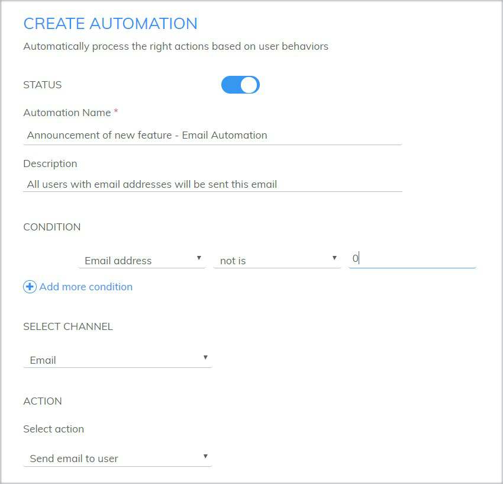
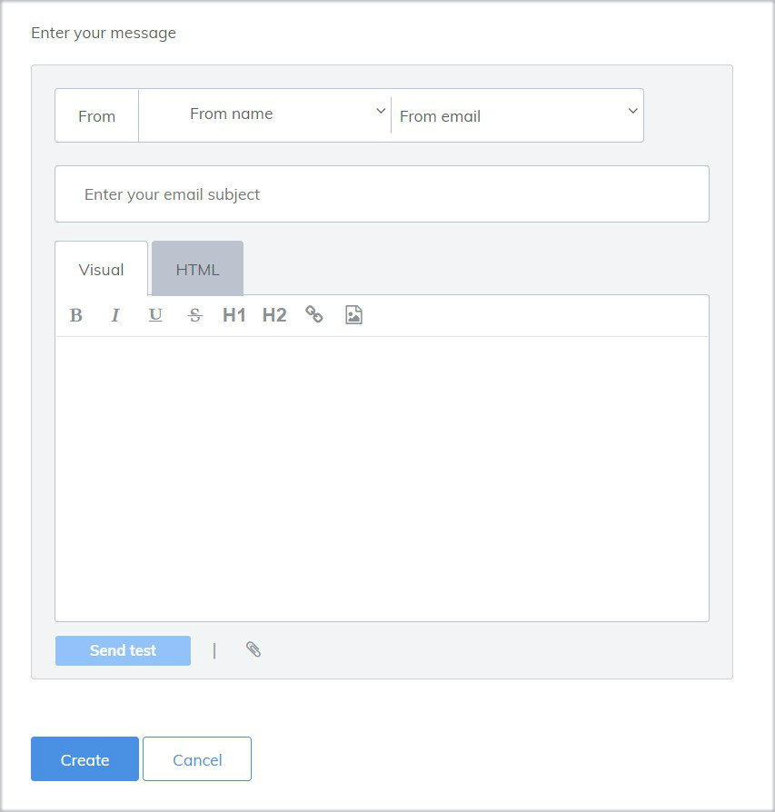

# Email Automation to send email to users

Email gives the great opportunity to re-engage users and increase purchase frequency. You can send emails to build relationship with users before or after purchasing, promote a product or service,  introduce new products, announce incentive programs.

With Subiz, you can set Email Automation to maket it automatical and simple to send emails to the right users.

### 1. How will Email Automation work? 

Email Automation will automatically send emails to the right users immediately after setting. Users  who have email addresses and meet the set-up conditions will receive an email automation.

Example: All users who have email addresses will be sent an email automation for new update.

### 2. Create new Email Automation

To create new Automation: Sign in to [app.subiz.com&gt; Setting &gt; Account &gt; Automation &gt; New Automation](https://app.subiz.com/settings/automation-add)

And do 2 steps:

* **Step 1**: Fill in set-up information 


**Notes:**

* **STATUS**: turn **ON**
* **Automation Name and Description**: Give your Automation a clear, easy-to-understand name. This will help you distinguish your Automations from each other as you create more of them.
* **CONDITION**: These are the conditions for performing the email action to users. For example, all user who have email addresses will be sent an announcement email of new feature.
* **SELECT CHANNEL**: select **Email**
* **ACTION**: Select **Send email to user**


* **Step 2:** Enter your message to send to users


**Notes:**

* **From**: choose From name, choose From email which 
* **Enter your email subject**: Great subject lines are brief and more likely to click through to see what you are proposing.
* **Message details**: You can create HTML email for your creation.


  

