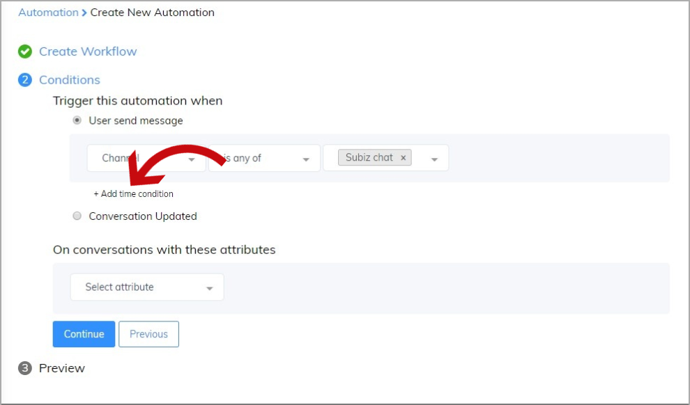

# Automation setting

With Automation, now you can automate interaction with your customers, attract visitors’ attention and pursue your customers through multiple channels. You no longer need to rely much on the availability of agents.

To create a new Automation, go to the Create New Automation section and perform the following steps:

### Enter a Name and Description for Automation

You can create Automation with one or more concurrent conditions.

### Select the condition for Automation

Select the condition to determine which Automation will target. To fill in the conditions, at first select the type of condition:

Then you enter the comparison and the value for that condition to create a complete condition.

Click **Add condition** when you want to add another condition. Select "Customer meets all conditions" or "Customer meets one of the conditions" to establish the relationship between the conditions: And/or.

You should **refer to the list of conditions**, with instructions on how to use it and the following specific examples:

| **CONDITION** | **USAGE** | **EXAMPLES** |
| --- | --- | --- | --- | --- | --- | --- | --- | --- | --- | --- |
| **User** | ​ | ​ |
| Name | Execute automation with specific user’s name | Send a special greeting or promotional email to the user named DavidCondition: Name – contains – David |
| Email | Execute automation with specific user’s email | Send a special greeting or email to all users whose email address contains subiz.comCondition: Email – Contains – subiz.com |
| Phone | Execute automation with specific user’s phone number | Send greetings or emails to users whose phone number is unknownSend automatic SMS to users whose phone number is known \(only applicable when SMS channel is integrated into Subiz\) |
| Country | Execute automation based on user’s country nameUse the country name in English, only capital first letter of the word. Example: Vietnam, United States[See detail in the list of country code](https://countrycode.org/)​ | Send greetings to customers in Vietnam with automation message in Vietnamese.Condition: Country – is – Vietnam |
| Country Code | Execute automation based on user’s country codeLook up the country codes in [ISO Code](https://en.wikipedia.org/wiki/ISO_3166-2) \(2 characters\), Example: Viet Nam = VN, Australia = AU, China = CN… | Send greetings to customers in Vietnam with automation message in Vietnamese.Condition: Country code – is – VN |
| City | Execute automation based on user’s cityUse the city name in English, only capital first letter of the word. For example, Hanoi, Ho Chi Minh City, New York, Hong Kong…See list [city code of each country](https://countrycode.org/) \(Click into each country to look up city name\) | Send greetings to customers in Hanoi.Condition: City – is – Hanoi |
| **Event data** | ​ | ​ |
| Page title | Each page typically focuses on a specific topic, you can set up an automation with each page to support customers at right time | Send greetings to customers who are viewing pages about “camera”.Condition: Page Title – Contains-Camera |
| Page URL | Execute automation when customers visit a particular page URL | Send a message to the customers who are viewing the pricing pageCondition: Page URL – is – https://subiz.com/en/pricing.html |

### Automation run in which channels?

You can select channels to run Automation. Each channel will have corresponding actions.

### The Action set for Automation


Each Automation will take only one action.




With the Subiz Chat channel, you can take one of two actions:

* **Send message to user:** You can send an auto message as soon as customers enter your website, or send a specific message to specific customers.
* **Ask for email address**: It can be used when you are not online or cannot answer immediately. Customers will enter their email address so that you can contact later.

Users will see auto messages/emails as a messages/ emails sent from that Agent.



With Email channel, you can take action **Send email to users**. 


This action only can be taken with users whom you have already got their email.


Choose action **Send email to user** on Email channel



How are messages/emails sent automatically?


* You can choose an agent to send messages and emails.

* You can customize the message more vividly \(bold/italic/insert link /send image\) via custom text tool.


### **Save Automation**

After all, click **Create** to finish.

