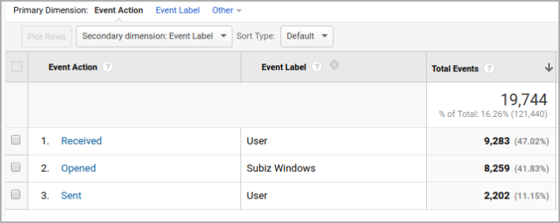

# Integration Google Analytics and Subiz

### How to integrate Google Analytics and Subiz chat 

In order to integrate [Subiz](https://subiz.com/en) with [Google Analytics](https://analytics.google.com/analytics/web/provision/?authuser=0#/provision), you just only [put the Google Analytics embed code ](https://developers.google.com/analytics/devguides/collection/)on your website. Subiz will automatically find the embed code and work with the Google Analytics account installed on the web. 

We support the following types of Google Analytics tracking: 

* [Gtagjs](https://developers.google.com/analytics/devguides/collection/gtagjs/)
* [analytics.js ](https://developers.google.com/analytics/devguides/collection/analyticsjs/)

###  How to work with Subiz with Google Analytics 

Subiz will send event data \(event data\) to Google Analytics. At that time, you can view this data in the Event section of Google Analytics. The Events that Subiz sends as below:The Subiz window is opened for any reason: User opens; Open Javascript API; Automation opens ...



The Subiz window is opened for any reason: User opens; Open Javascript API; Automation opens...  
 **** ✔ Event Category: SUBIZ Chat   
  ✔ Event Action: Opened   
  ✔ Event Label: Subiz Windows



User receives message of agents or automation ....   
 ✔ Event Category: SUBIZ Chat   
 ✔ Event Action: Received   
 ✔ Event Label: User



The user sends a message via the Subiz chat window  
 ✔ Event Category: SUBIZ Chat   
 ✔ Event Action: Sent   
 ✔ Event Label: User



### Data Mining 

From these data, you can use it to analyze visitor behavior on Google Analytics or you can set it to become a Goal \(GOAL\) and sync it to your adwords account.

* Analyze interactive guests Subiz by Campaign advertising.
* Interactive guest analysis Subiz by Traffic Source \(Traffic Channel\).
* Analyze buyers on the website and have Subiz interaction.
* Analyze buyers on the website and have Subiz interaction.
* Setting up Subiz as a channel of traffic to understand how many interaction sessions they have to purchase.
* Use to filter customers who interact with Subiz to run Remarketing ads. 

### Frequently asked questions when integrating with Google Analytics 

⏩ **Website has many Google Analytics embed codes, which account will Subiz send to?** S_ubiz sends to all integrated accounts._ 

⏩ **If Google Analytics is installed via Google Tag Manager, will Subiz send data?** _Yes, we will._  
⏩ **When will Subiz send data to Google Analytics?** _At the time of the event._

[How to view Subiz reports on Google Analytics.   
](https://help-en.subiz.com/general-reports/google-analytics-and-subiz-chat-integration)[Subiz works with Facebook Pixel.](https://help-en.subiz.com/integration-with-third-parties/untitled-1)

