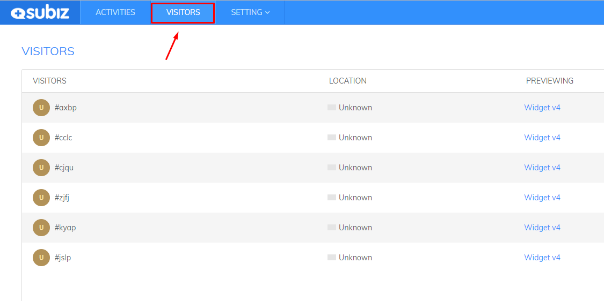
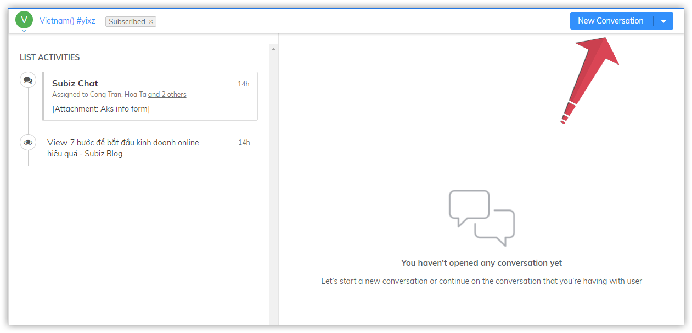

# Managing data

### How to tracking visitors?

You can follow visitors who are visiting your website on the **Visitor** page. Each visitor is identified by the cookie on their browser.

Visitors go to website to find out information, products and services of the business. **All of them can become potential customers, so look at what information they are interested in to proactively reach and support them.** The more interactive you are, the higher your chance of sales. Do not miss the thousands of customers who are visiting your website daily

Subiz allows you to gather basic information that will help you gain crucial insights about your visitors and their behavior when they are on your website. 

* **Name and Email**: These information was stored from the previous visit or transfered from website’s database to Subiz through API Javascript
* **Location**: Country and City where visitor is accessing from. It’s identified basing on IP address
* **Previewing**: The page \(or very last page\) which visitors are visiting
* **Type**: New/ Return

When click on each visitor, you will be redirected to Activities page to make conversation with that visitor

### Where does Subiz determine where visitor location is based?

To determine customer geo location, Subiz uses 3rd party services as Maxmind. It is determined based on the IP address. These IP addresses are sometimes associated with an Internet Service Provider \(ISP\) or VPN \(Virtual Private Network\), so the difference with the actual location of the customer is likely to occur.

One of the other reasons that this information is not 100% accurate is because the 3rd party database updates inaccurately or is out of date due to not timely updates of the change.

To correct this inaccuracy, you can send a direct request to Maxmind to request the correct update: https://support.maxmind.com/geoip-data-correction-request/

With the misconfiguration of the location information when performing access between machines within the same company, you can check the IP address information of these computers.

