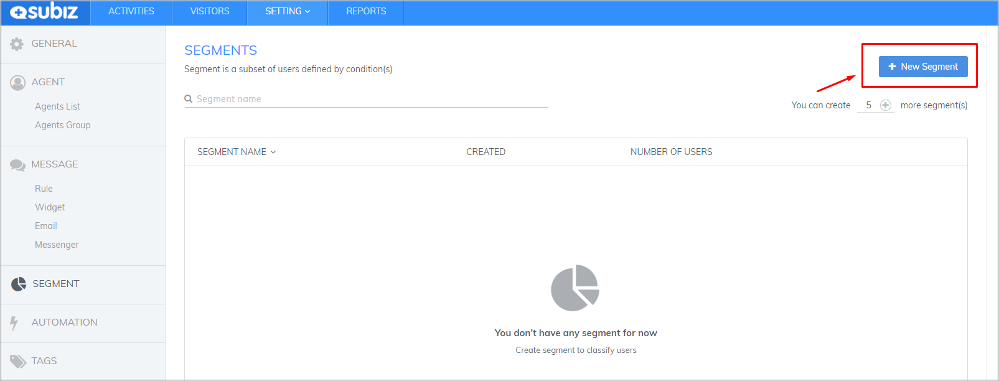
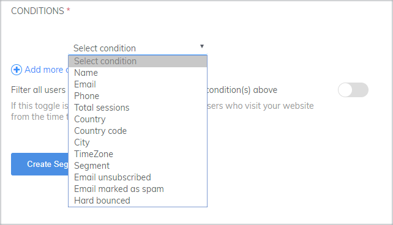
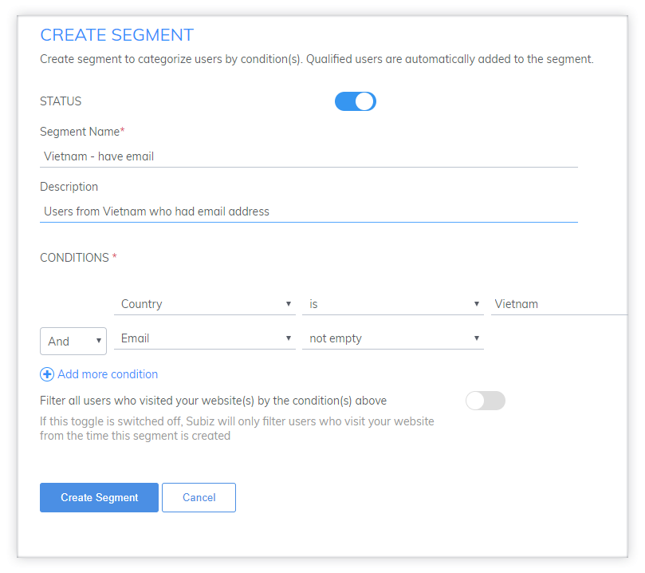
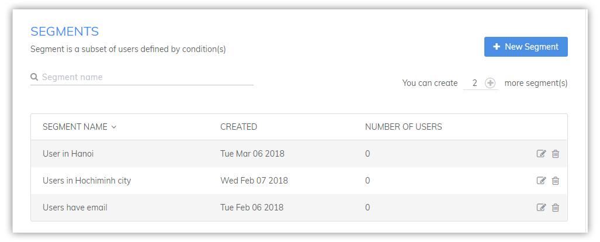
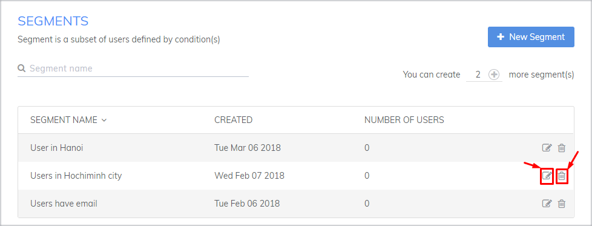
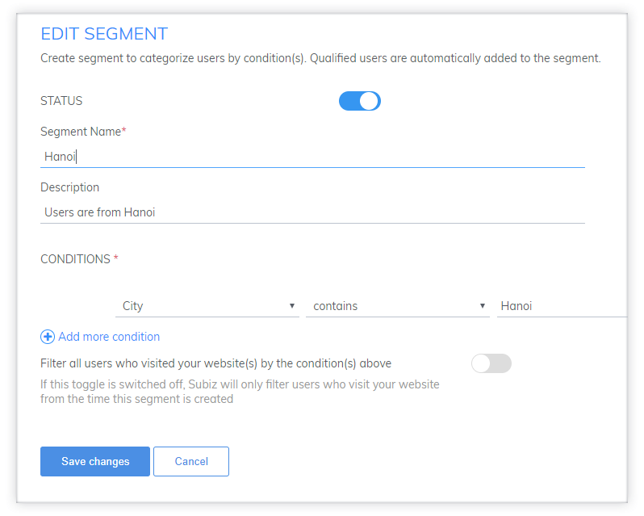
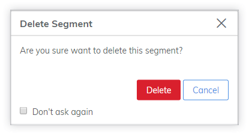

# Customer segmentation

**Segment** is a group of customers divided by certain criteria. This feature is designed to **help you categorize and split customer data, helping you to strategically follow each customer segment.**

### Create new Segment

On the Segment Settings page, you can create new segments, track and edit segment lists.

To create a new segment, go to [**Setting&gt; Account&gt; Segment**, select **New Segment**.](https://app.subiz.com/settings/segment-list)

Follow these step to create Segment:

* Select status **Active/ Inactive**
* Enter **Segment name** and **Description**
* Set up **Condition**

* Click **Add more condition** if you want to combine conditions
* Select relationships between conditions
  * **And:** Users with all conditions satisfied will be included in the Segment
  * **Or:** Users with one of the conditions satisfied will be included in the Segment
* Click **Create Segment** to finish

For example: Segment of users from Vietnam and email address is known.

**Filter all users \(**only available in Advanced package\):

* **ON:** Filter all users who visited your website\(s\) by the condition\(s\) above
* **OFF:** Subiz will only filter users who visit your website from the time this segment is created


The segment will be only created when you are using the Trial or Advanced packages. You will see the number of segments below the Create segment button. If you have used up the number of Segments allowed, you need to upgrade your account to Advanced Package or buy add more to create new Segment.


### Segment management

#### Segment list

Segments created will be displayed in the Segment list.

* **Created**: The day when the segment was created

This time involves filtering users of Segment, in the case of “Filter All Users” is OFF.

In case of having changes in segment conditions, the created- time will be counted as the last change of condition \(equivalent to creating a new segment\).

* **Number of users:** Number of users in the Segment

After the segment is created, it will take a certain amount of time to determine the number of users in the segment. In some cases, the number of users will be displayed as “Estimating” instead of specific figures.

#### **Edit / Delete Segment**

When you need to edit or delete a segment, click the corresponding button in the segment list.

To **edit a segment**, select the **edit icon**, then update the information and select Save Changes.

If you change the conditions in the Segment, the data will be updated from the time you change \(in case “Filter all users” is OFF\). This is equivalent to creating a new segment.

To **delete a segment**, select the **Delete icon**, then click Delete to confirm.

