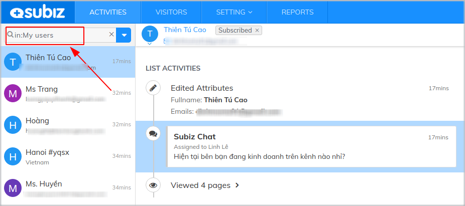
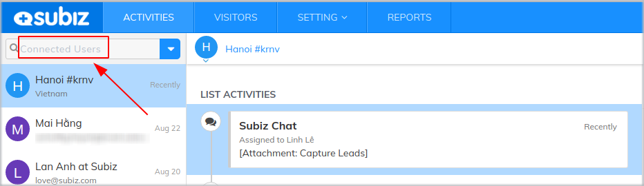
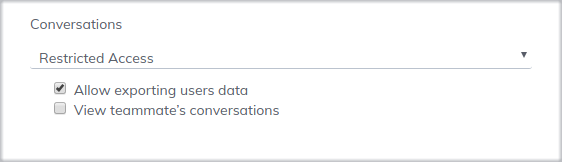
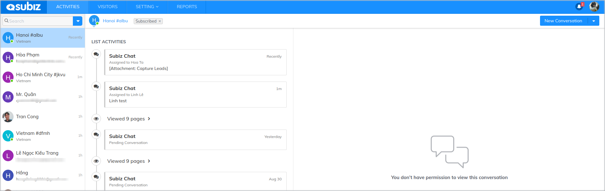
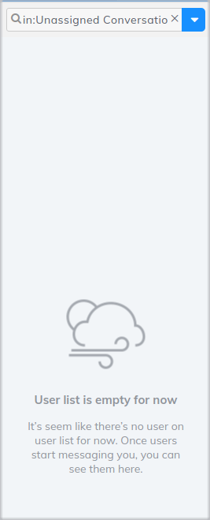
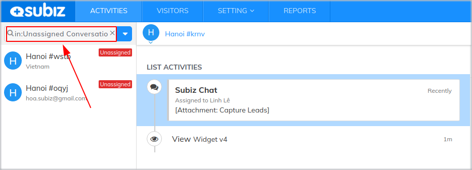

# Utilizing Default Segments

To manage User lists and interactions generally, Agents can use the Subiz default segments that have been set up in the search bar in the Activities page. The following instruction will help the Agent understand the meaning and usage of these segments.

### My Users

This is a list of all  users who have interacted with each Agent . Each Agent will have a separate User list. In this segment, Agent can view all conversations in chronological order, the activities of the User on the website and their interaction history.

### **Connected Users**

This is a list of all Users who have interacts with the Agents of the business.

* **If you are an Agent Owne**r 

This list will help you understand the situation of Customer Service and Sales such as the number of Users having interaction each day, the conversion rate, the attitude of agents... Agent Owner can read all conversations of other Agents and monitor the activities of the User...

* **If you are an Invited Agent**

You can see the list of users interacting with you and other agents. However, depending on your permissions, you may or may not view the conversation of other Agents. For example, you have restricted access to other Agent conversations:

In this situation, you can only see the list of all Users and their activities except the content of their conversations with other Agents.

You can ask the full-access Agent to check your permission in [Agent Permission ](https://app.subiz.com/settings/agents-edit?id=agqacrftoiiavslipp)

### Unassigned Conversations

This is a list of conversations that have not yet been delivered to Agents

* No unassigned conversation

* Unassigned conversations

**Reason:** 

- Due to Incorrect rule setting, Agents cannot receive the conversations 

- Due to the installed rules do not cover all situations.


**Notes:** You can join these unassigned conversations


