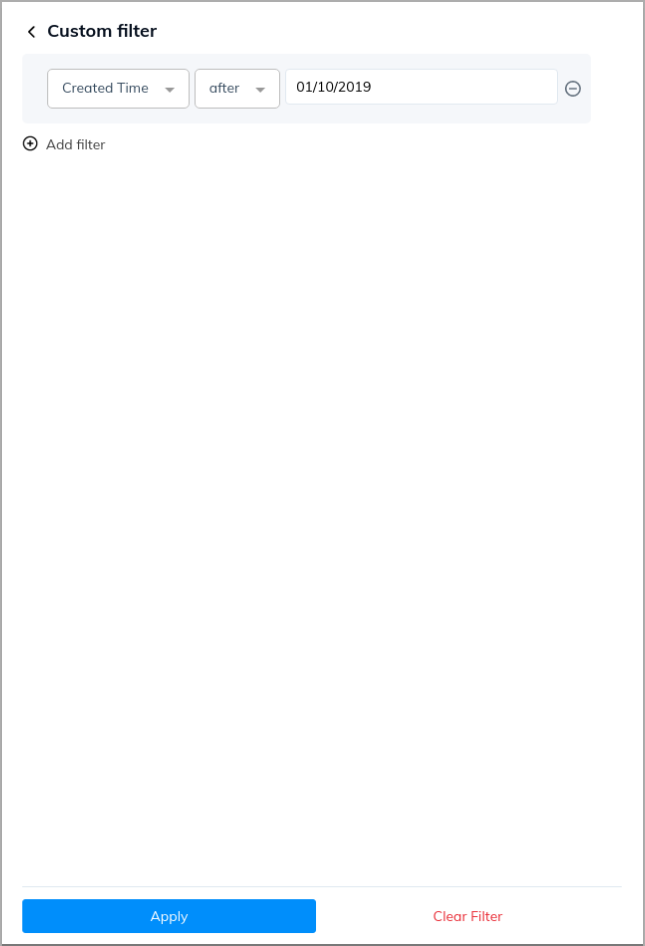
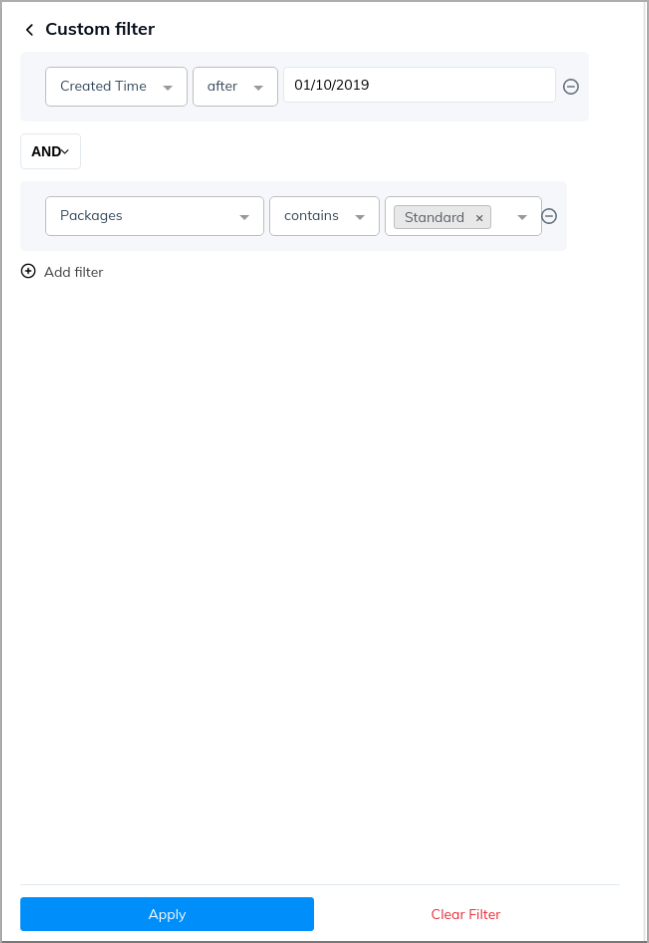
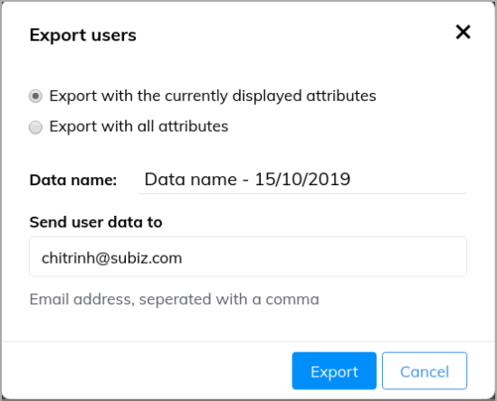
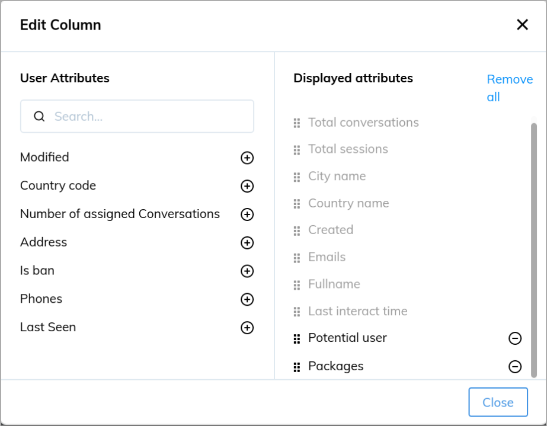
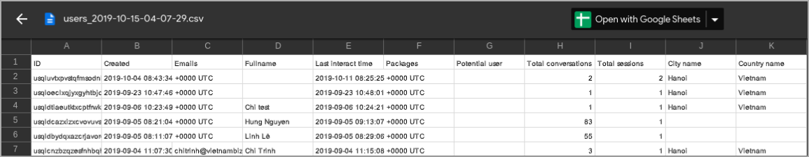
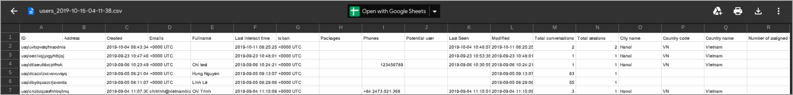
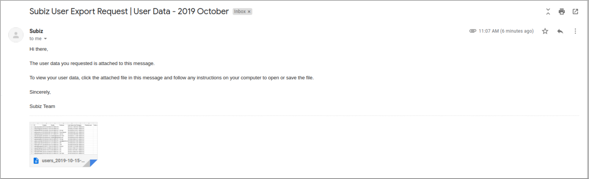

# Export user's data

Customers are a determining factor in the development of businesses. Therefore, businesses need to build customer data systems to gain user understanding to facilitate customer care and increase the accessibility of new customers. 

In addition to managing customer data on Subiz, you can export customer data files from Subiz to store on the enterprise's management system or facilitate statistics and reporting. 

To export the data file, you need to go to the [Contact page](https://app.subiz.com/contacts), which administers the entire list of customers who interact with your business.

Select **Filter** if you want to export the data file with one or several conditions. 

Example: Filter users created after 2019, October 1st.

You can combine many conditions: 

Example: Filter users created after 2019, October 1st and using the Standard Plan

After clicking **Apply**, the User list will display, click on **Export data** to export the file to the email:

You have two choices as below:

* _**Export with the currently displayed attributes:**_ the default attributes or you have added in the **Edit column** previously:

Then the data file sent will display as below:

* _**Export with all attributes:**_ include all default attributes of users

Then the data file sent will display as below:

* **Data name:** The name of your data file will appear as an email subject for easy searching. 
* **Send user data to:** You could fill one or several emails receive data files. 

Then the data file sent will display as below:

