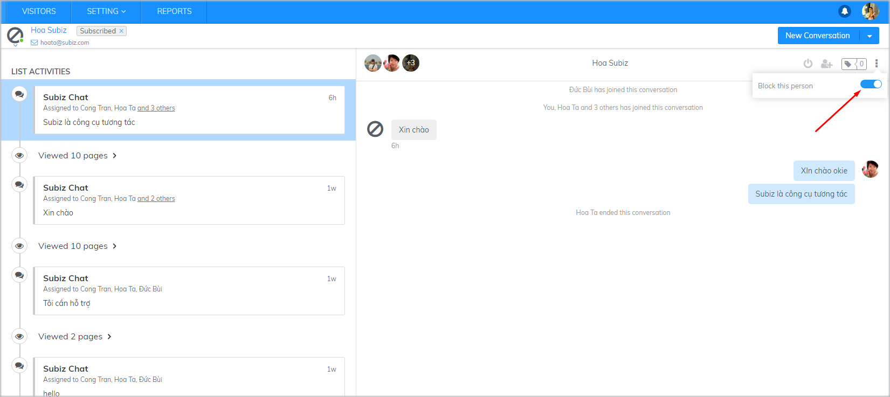

# Block a User

While interacting with customers on Subiz, you may encounter some annoying users who have impolite attitude or behavior that affects badly on your business. How do you prevent these users from sending email/ messages to the business? The following article will give you some specific instructions.

### How to block a user?

You can block a user by 2 ways:

**1. Block a user on tab Activities** 

In the conversation, you can block the user by clicking the  icon in the right corner of the screen and turning on the Block button

 **2. Block a user in Blacklist**

**Blacklist** is a list of users that you have blocked. To add to this list, go to **Settings / Account / Blacklist / Block**. Here you just copy the **IP address**, **Email** or **ID** of the user who you want to block.



Every user connecting to the internet has an IP address. You can enter IP addresses into BlackList to block this User.

However, in the case of many users sharing the same IP, this block will prevent the remaining users. For example, in case the Subiz Team is using an IP of 112.134.233.134, if this IP is blocked, all computers in the Subiz Office will not see the widget displayed on the Subiz.com.


Note: IP address blocking is performed when you want to block users via the Subiz Chat channel. This user will not see the Widget on the website.




After entering the email of the user you want to block, all mail sent from this address is blocked.


 Note: Email Blocking is used when you want to block interactions via email channel.




Every user connecting to Subiz is given a code and called User ID. What you need to do is copy the ID of the user you want to block in Activities tab and paste into the block:

This is the most accurate and comprehensive way to block a user via all channels such as Email, Subiz Chat, Messenger.

**How to get the User ID**: Click on a User in the Activities tab, get the URL and copy the line as follows:




### Manage Blacklist

To keep track of the list of blocked users as well as block history, you can log in the Blacklist



This is the list of Blocked ID, Email and IP




This is a list of Blocked users, Agents block and Time block




### Unblock a user

There are 2 ways to unblock a user as follow:

* **Unblock directly on the Activities page**: From the activities tab -&gt; Find User and disable Block User.
* **Unblock in Blacklist**: In BlackList, click on the remove icon remove block for the user you want to unblock.

###  What happens when you block a User?

* On Subiz Chat Channel: the user will not see the chat widget and can not create a conversation or send a message.
* On Email Channel: The email of user will be blocked at Subiz Core. That mail will not be shown to the Agent.
* On Messenger Channel: Messages are blocked on the Subiz Core and are not visible to the Agent \(Note: The message still exists and is displayed if the user uses Fanpage admin\)
* Avatar of Blocked User will be displayed as follow

