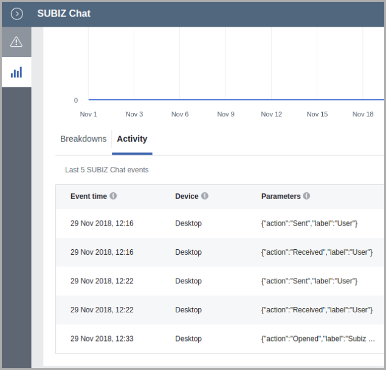

# Integration Facebook Pixel and Subiz

### How to integrate Facebook Pixel and Subiz 

In order to integrate [Subiz](https://subiz.com/) with [Facebook Pixel](https://developers.facebook.com/docs/facebook-pixel/?locale=en_US), you just only put the Facebook Pixel embed code on your website. Subiz will automatically find the embed code and work with the Facebook Pixel account installed on the web. We only support [fbevents.js](https://developers.facebook.com/docs/facebook-pixel/implementation#base-code) embed code. If you have not used Facebook Pixel, this is the [document to install](https://developers.facebook.com/docs/facebook-pixel/implementation#installing-the-pixel). 

### How to work with Subiz with Facebook Pixel

Subiz will send event data to Facebook Pixel. At that time, you can view these data at the Event section of Facebook Pixel. The Events that Subiz sends as below:



The Subiz window is opened for any reason: User opens; Open Javascript API; Automation opens ...   
 ✔ Event Name: SUBIZ Chat   
 ✔ Parameter "action": Opened   
 ✔ Event Label: Subiz Windows



User receives message of agents or automation ....   
 ✔ Event Name: SUBIZ Chat   
 ✔ Parameter "action": Received   
 ✔ Parameter "label": User



The user sends a message via the Subiz chat window   
 ✔ Event Name: SUBIZ Chat   
 ✔ Parameter "action": Sent   
 ✔ Parameter "label": User



### Data Mining 

* Use to create Custom Audiences according to marketer needs.
* Use to set conversion and run ads like CTA on Facebook Ads. From then on evaluate the effectiveness of the advertising campaign. 

### Frequently asked questions

⏩ **Website with lots of Facebook Pixel codes, which Subiz will send data to Pixel?** _Subiz sends to all the pixels installed on the web._   
⏩ **Facebook Pixel is set up via Google Tag Manager, does Subiz send data?** _Yes, we does._   
Related articles: [Subiz works with Google Analytics.](https://help-en.subiz.com/integration-with-third-parties/integration-google-analytics-and-subiz)

