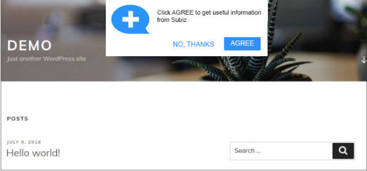

# Embed code subscribe push notification

Subscribe Push Notification is a powerful feature that helps you attract the User back to the website based on the interactive message on the Subiz widget. In this document, we give an example to help you attract more users to agree to receive notifications on the screen.

### Implementation script 

The script is to set a popup to ask if the visitor agrees to receive the notification. When users click agree, Subiz API Javascript will call to receive notifications to activate the installation.



### How to installation in your website 

In order to install Javascript API in your website, please copy the following html code and placed after the Subiz embed code in the website, before the tag. 

```c
<style type="text/css">
@import url('https://fonts.googleapis.com/css?family=Muli:300,400,700&subset=latin-ext,vietnamese');
body{margin:0px; padding: 0px;font-family: 'Muli', sans-serif; font-weight: 400; font-size: 16px; color: #4a4a4a; -webkit-font-smoothing: antialiased; -moz-osx-font-smoothing: grayscale;}
*{box-sizing: border-box;}
.popup-subscribire{position: fixed; top: 20px; width:500px; left: 50%; margin-left:-250px; padding: 18px; border-radius: 3px; background: #FFF; box-shadow: 0px 0px 20px rgba(5,25,62, .15);z-index:99999;display: none;}
.popup-logo{ display: inline-block; vertical-align: top; width:80px; margin-right:20px;}
.popup-logo img{max-width:100%;}
.popup-summary{display: inline-block; width:calc(100% - 80px - 25px); line-height: 21px;}
.popup-bottom{position: relative; width:100%; padding: 5px 0 0 0; text-align: right;}
.popup-bottom a{ display: inline-block;vertical-align: middle; margin:0 3px; height: 40px; line-height: 38px; padding: 0 25px; color: #1890ff; font-size: 16px; font-weight:500; text-transform: uppercase; text-decoration: none; border-radius: 3px;}
.popup-bottom a.ok{ color: #FFF; background-color: #1890ff;}
</style>
​
<div class="popup-subscribire">
  <div class="popup-logo"></div>
  <div class="popup-summary">Click vào ĐỒNG Ý để nhận được các thông tin hữu ích từ Subiz.</div>
  <div class="popup-bottom">
    <a href="javascript:void(0);" onclick="closePopUp();">Không, cảm ơn</a>
    <a href="javascript:void(0);" class="ok" onclick="subiz('subscribePushNotification');closePopUp()">Đồng ý</a>
  </div>
</div>
​
<script type="text/javascript">
  function closePopUp(e) {
    document.querySelector('.popup-subscribire').style.display = 'none'
    if ( typeof(Storage) !== 'undefined') {
        sessionStorage.setItem('closePopUp', 1);
    }    
  }
  navigator.getBattery().then(function(battery) {
    if (battery.charging && battery.chargingTime === 0) {
      console.log("I'm a desktop")
      if(!window.subiz) {
        console.log('Have no code subiz')
        return
      }
      subiz('checkPushNotification', function(status) {
      if(status || (typeof(Storage) !== 'undefined' && sessionStorage.getItem('closePopUp'))) return
        document.querySelector('.popup-subscribire').style.display = 'block'
      })
    }
  });
</script>
```

Noted:

* Replace the path of logo.png with the path of your logo.
* Custom styles and colors to match them by Customize CSS. You should also match CSS with css file of the web to make it neat.
* The question popup will show up until the user closes.

