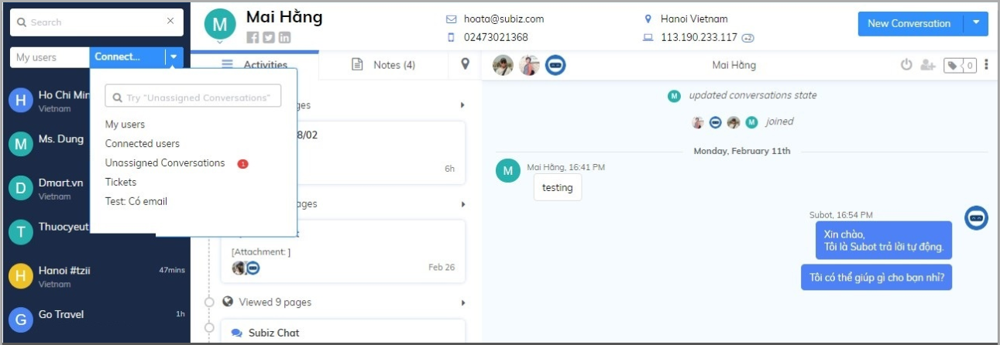
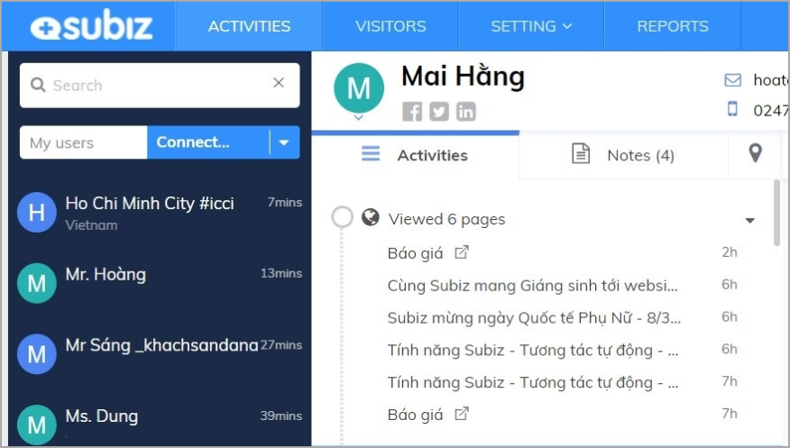

# Manage and update user information

User is the customer who interacted you via [Subiz](https://subiz.com/en), including having conversation with agent over channels like Subiz chat on the website, Fanpage Messenger and Email. The user list is displayed in the first left pane on page [ACTIVITIES](https://app.subiz.com/activities) .

On page [ACTIVITIES](https://app.subiz.com/activities), you can track and manage user list, activities list of user and edit user information.

### User list 

The users list are all of users who have conversation via multiple channels with agent. Agent can search users base on information such as Full Name, Email Address, Phone Number. 

There are 4 segment of user lists for agent tracking and manage user. 

* My user: Every agent will have a separate "My User" list who have a conversation with the agent before. Agent will follow the users who they supported.
*  Connected users: All users have conversations with the agents in the account. Connected users help managers to manage user contact status and the way how to agent support them. 
* Unassigned conversations: The user’s conversations that have not been assigned to the agent will be automatically transferred to "Unassigned conversations". Agent can check and answer users. See more Distributed Rule settings for conversation with agents. 
* Tickets: The list of users that have tickets needs follow and processed. See more instructions how to use Ticket to Manage Customer Care. 

Conversations marked unread messages will display red notifications. The avatar of the user instate of online \(blue dot\), otherwise the user is offline.

### User information 

**Agent can follow a new user base on their address of the City + user code and Country.** You can click to select user and change user information such as Full name, Email address, Phone number ..... In order to update and manage multiple user data such as Billing cycle, Account ID, Website, ... you can add USER ATTRIBUTES as instructed here.

### User’s activities list 

When agent click to any user, you can track the User's activity list including View page on website, conversation history via multiple channels like Subiz chat, Messenger, Email. Conversations marked unread messages will display red notifications. Agent can Note user information, their issues or overview situation of customer support.

