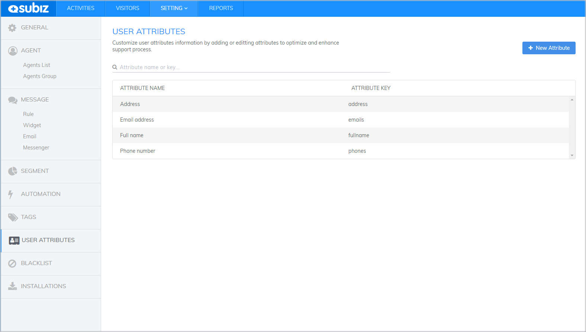
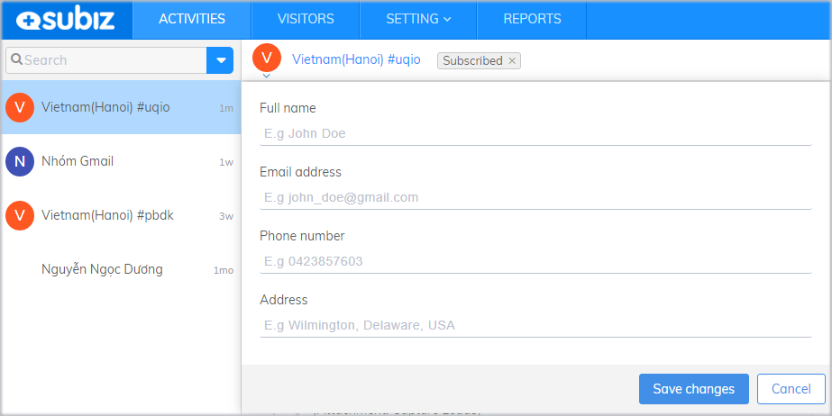
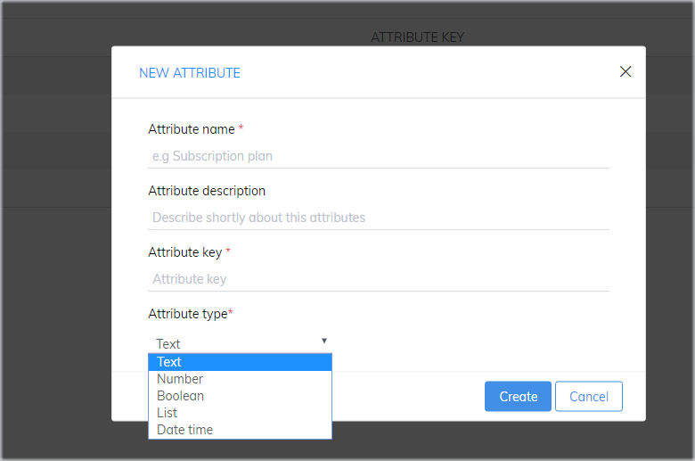
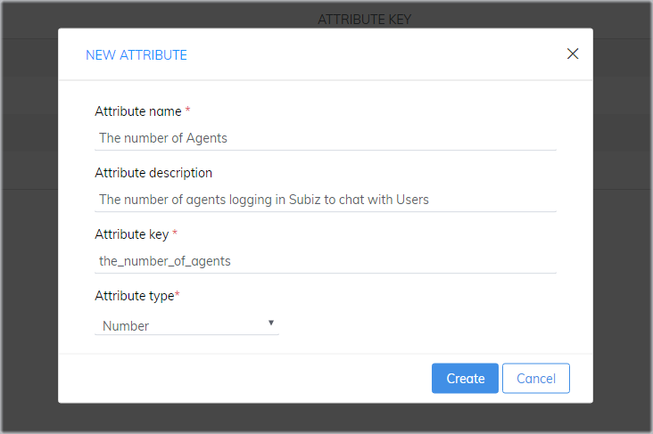
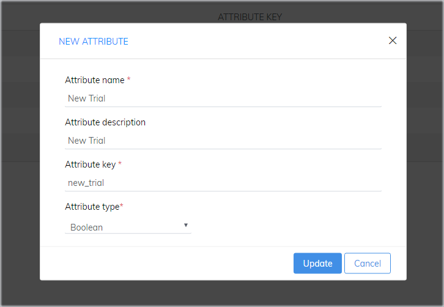
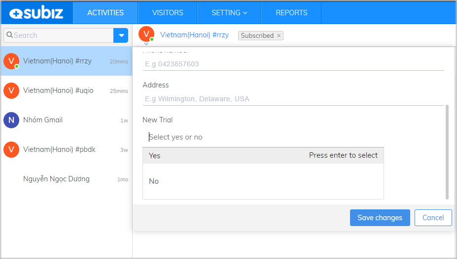
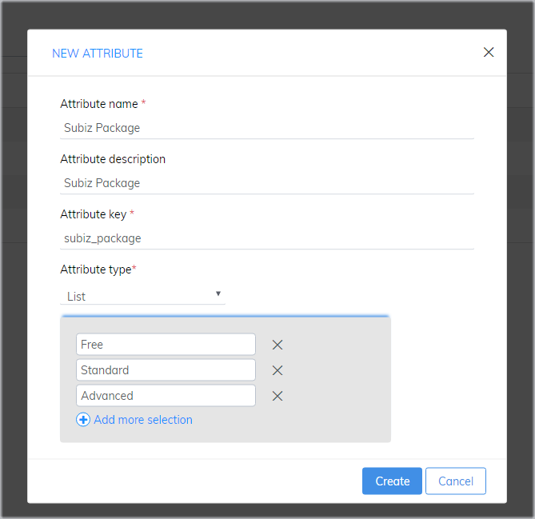
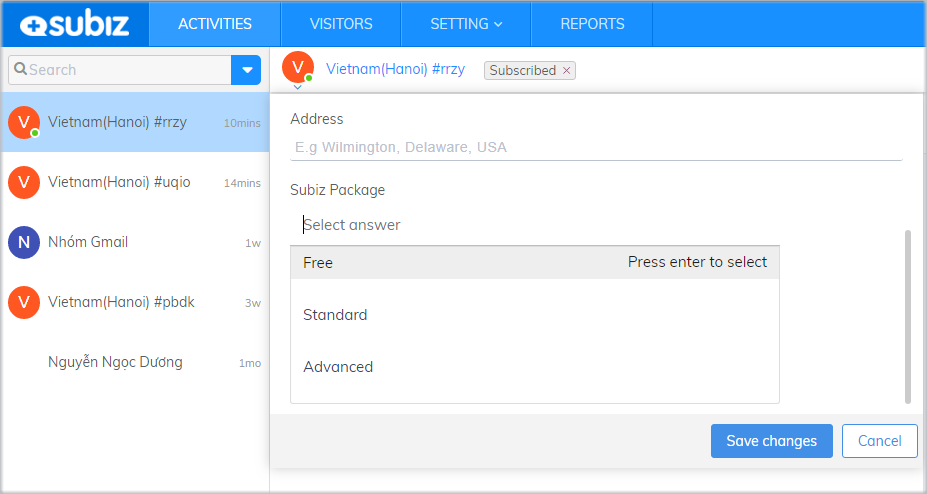
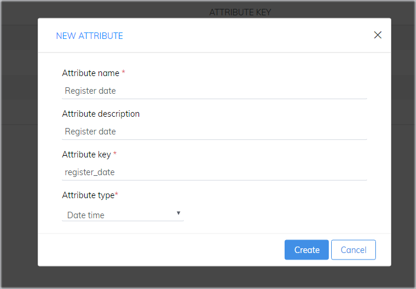
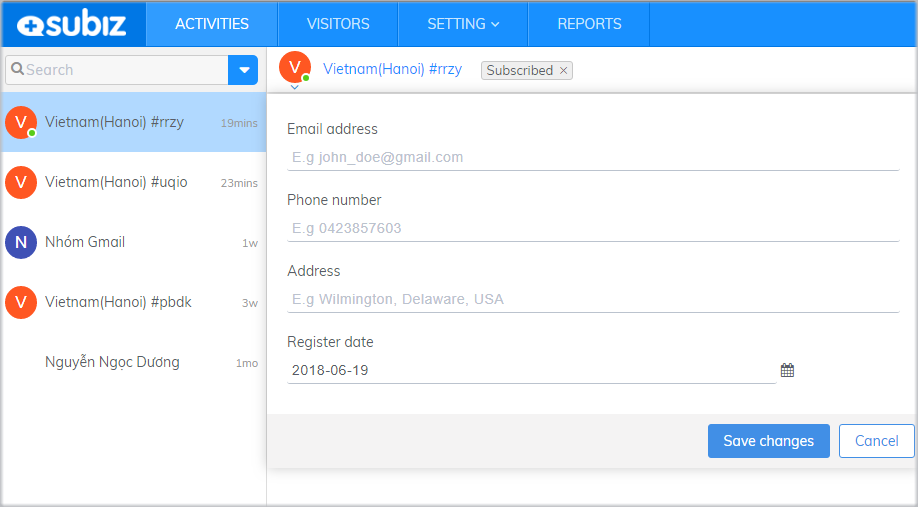

# User Attributes

Management of customer information will help enterprises to access and communicate with customers in a systematic and effective manner to serve customers better.  
  
Since User Attributes are updated and stored in the [Subiz](https://subiz.com/en) management system, the business can analyze and form a list of potential customers, thereby developing a rational care strategy to maintain a good relationship with customers and achieve maximum profit in business.

### User Attributes

To customize your User Attributes, you need to go to page [ User Attributes](https://app.subiz.com/settings/user-attributes) on your Dashboard  
  
A [Subiz](https://subiz.com/en) account will have 4 default user attributes: Address, Name, [Email](https://subiz.com/email.html) and Phone Number

These attributes will be displayed in the User Info as follow

### Customize User Attributes

[Subiz](https://subiz.com/en) allows you to add a new user attribute, which serves the purpose of extracting and managing customer information according to the specific characteristics of each business:  
  
To customize your User Attributes, go to  ****page [User Attributes](https://app.subiz.com/settings/user-attributes#) and select **New User Attribute**

**Attribute name**: The name of the user attribute you want to display in the User Info  
  
**Attribute description**: The detailed description of the attribute will help you easily manage and explore the data.  
  
**Attribute key**:  Attribute key need to be written with the normal letters, underscore between each letter and  without any special characters. For example: the\_number\_of\_agents

**Attribute type**:  The display of data in the User Info



Type of data: Text

In the User Info, you will see as follow:




Type of data: Number

In the User Info, you will see as follow:




Type of data: Yes/ No

In the User Info, you will see as follow:




Type of data: List

In the User Info, you will see as follow:




Type of data: Date

In the User Info, you will see as follow:

  



### Notes

* An account  has maximum 20 user attributes
* Limitation of stored data value of a user attribute: 500 characters
* You can edit or delete a user attribute. However, when an attribute is deleted, all saved information is deleted and can not be restored

