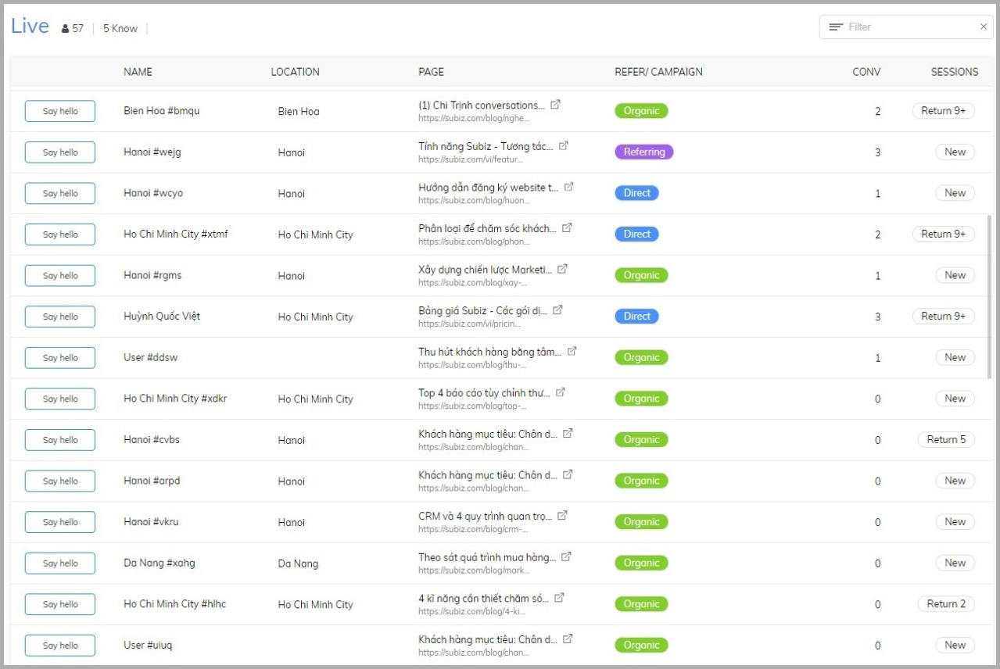
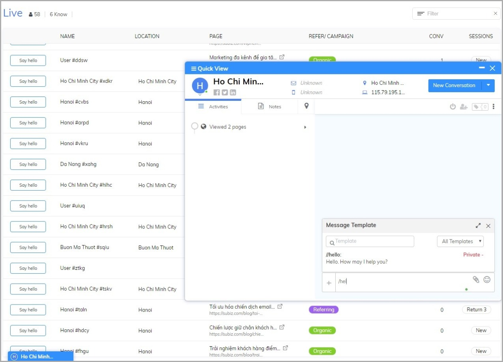
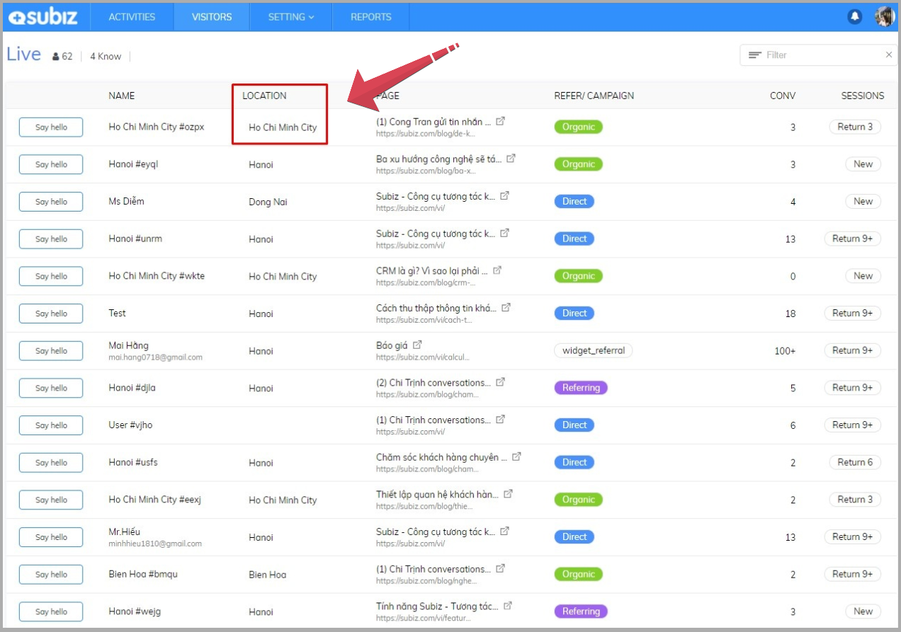

# Visitor Tracking

### How to tracking visitors? 

Businesses can observe their website visitors, get the customer needs of products and service and actively interact to support them.

You can track visitors who are visiting your website at [VISITORS page](https://app.subiz.com/visitors). Who are they, where do they come from, which pages are viewed on the website, new users or return users or if they have any conversation before.

You can gather basic information that will help you gain crucial insights about your visitors and their behavior when they are on your website:

* **NAME:** Default by visitor code or display the name of the customer if updated information. 
* **LOCATION:** City / province is determined via IP address. 
* **PAGE:** Title and link to the page you are viewing on your website. 
* **REFER / CAMPAIGN:** The source of visitors like Direct access into the website, Organic into the website from the natural search results on the browser, Referring to access the web from the introduction page, Social is the visitor from the website Social, Advertising access web from advertising links, ... Subiz automatically recognizes the UTM campaign link and visitors from which campaign. 
* **CONVERSATION:** The total number of conversations with users including Automation sends messages 
* **SESSIONS:** New user or Return users. 

You can identify potential customers and take the initiative Say hello to customer advisory messages. Reaching customers at the on time will increase sales opportunities effectively. Use the [Message Template](https://app.subiz.com/message-template) to quickly send greetings to customers.

### How [Subiz](https://subiz.com/email.html) determine visitors location? 

The IP address is associated with ISP \(Internet Service Provider\) and is constantly changing. Therefore, the IP address will be changed and different from real-time location of user.

Twice a year, Subiz periodically updates IP address data to improve accuracy and commit accuracy to 95% of Country location and to 75% City / Province location.

Subiz identifies users IP address based on Maxmind data. This is the most accurate data of the world on IP address to Location and NASA also uses this data.

If the user's IP address is not correct, you can send a request directly to Maxmind to update it correctly: [https://support.maxmind.com/geoip-data-correction-request/](https://support.maxmind.com/geoip-data-correction-request/)

