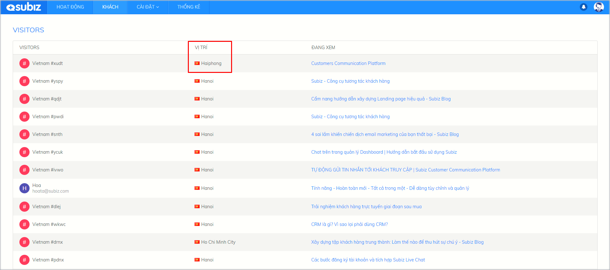

# Visitor Tracking

### How to tracking visitors? {#how-to-tracking-visitors}

Businesses can observe their website visitors, get the customer needs of products and service and actively interact to support them.

**You can track visitors who are visiting your website** at **Visitors** page where each visitor is identified by a [cookie](https://en.wikipedia.org/wiki/HTTP_cookie) on their browser.

You can gather basic information that will help you gain crucial insights about your visitors and their behavior when they are on your website:

* **Name and** [**Email**](https://subiz.com/email.html): These information was stored from the previous visit or transfered from website’s database to [Subiz](https://subiz.com/en) through API Javascript
* **Location**: Country and City where visitor is accessing from. It’s identified basing on IP address
* **Previewing**: The page \(or very last page\) which visitors are visiting
* **Type**: New/ Return

When click on each visitor, you will be redirected to Activities page to make conversation with that visitor

### How [Subiz](https://subiz.com/email.html) determine visitors location? {#how-subiz-determine-visitors-location}

To determine customer's geographical location, [Subiz](https://subiz.com/email.html) uses a third party services as Maxmind. As such, the visitors location is determined based on the IP address. These IP addresses are sometimes associated with an Internet Service Provider \(ISP\) or VPN \(Virtual Private Network\), so the difference with the actual location of the customer is likely to occur.

One of the other reasons that this information is not 100% accurate is because the third party database updates inaccurately or is out of date due to not updating the change timely .

To fix this inaccuracy, you can send a direct request to Maxmind to request the correct update by clicking: https://support.maxmind.com/geoip-data-correction-request/

With the misconfiguration of the location information when performing access between machines within the same company, you can check the IP address information of these computers.

