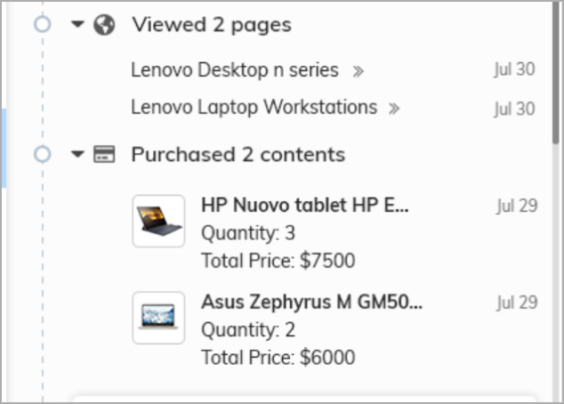
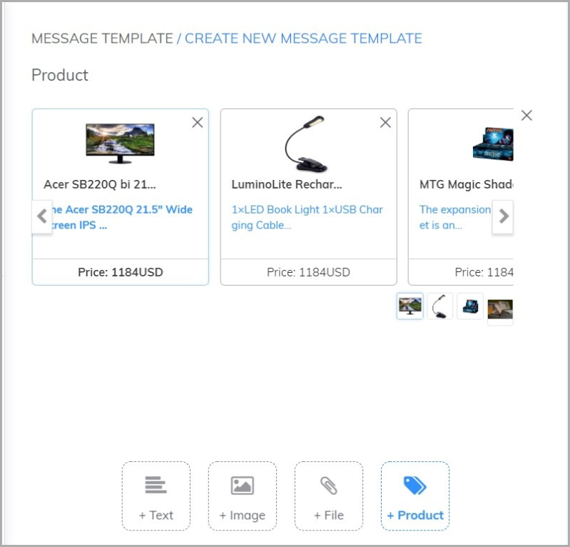
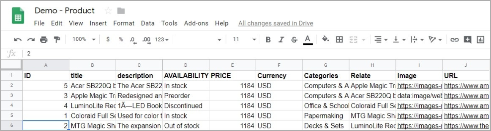

# Product

### What is product management? 

Product management is the easiest way to save product information that your business is trading on Subiz, from that point you can send products to users, invite users to buy products right on Subiz widget, you could also ask their feedback on a specific product … 

The product management function helps you to save and not replace business inventory management software. But it has the ability to synchronize data to help employees easily access information and ware houses. You could import products into Subiz as bellows:

### Use Products stored on Subiz 

You could refer some example about how to use Product feature in Subiz as bellow: 

* Subiz recognizes what users see and displays them on the agent's screen. 

* Use Products to create Message Templates in order to send users. 

* Used in Automation.

### Import product data from CSV file 

Comma Separated Values \(Comma Separated Values\) is a simple text format in there values are separated by commas. CSV files can also be opened using Google Sheet or Excel. View the [Google Sheet Demo file](https://docs.google.com/spreadsheets/d/1TfLSYcndNjxFC56GOTtz_vxYocPbbxcla52tzkiBLqg/edit#gid=0), from Google Sheet you can download the CSV file. 

After you have prepared the CSV file containing the product data. Follow these steps: 

* Step 1: Access Subiz Settings&gt; [Product](https://app.subiz.com/settings/content-import). Select the "**Import products**" button. Follow the instructions to upload your product CSV file. 
* Step 2: Declare the data columns in the CSV file to match the Subiz data fields provided. Then click the "**Import products**" button. 

You could refer Subiz data fields as bellows:

| Data fields  | Describe |
| :--- | :--- |
| _ID_ | The code of the product you set up for your own. Subiz used to identify product. For example: 12456 |
| _Title_ | Name of Product |
| _Description_ | Short description of the product. |
| _URL_ | Product path, may be a product detail page on the website. |
| _Image_ | The link to the image of the Product. |
| _Availability_ | In state of the product is in stock or not. Example: in stock; out of stock; pre order; discontinued ... |
| _Price_ | Price of the product. Example: 1,000,000. |
| _Currency_ | The currency for the price. Example $ or VND. |
| _Sale price_ | The price discounted. Example 980,000. |
| _Fields_ | The other custom data you would like to upload. |

### Frequently asked questions

1. **Products How to update a product data?** You can create a CSV file containing that product separately. Subiz will identify by ID \(product code\) to overwrite the data. 
2. **Does Subiz have automatic data synchronization from the website?** We are developing this function.

