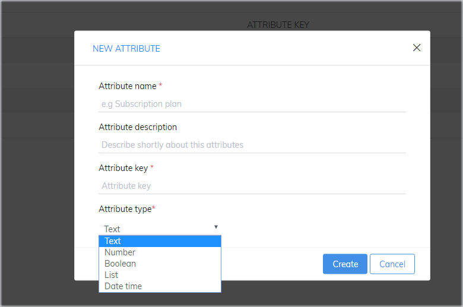

# Synchronize users data with Subiz API

API \(_**application programming interface\)**_ is a set of clearly defined methods of communication between various software components. Subiz provides a Javascript API that synchronizes users data between the Subiz app and the website. You can update users information, retrieve users and clear users.


Important notes:

* API snippets should be placed after the Subiz embed code in the website code page. No need to follow closely, just make sure the Subiz embed code is placed over the API snippets.
* To use Javascript API, only programmers can install according to instructions. If your business does not have its own programmer, hire a frelance programmer to help them.


### 1. User attributes

The four default user attributes set up on Subiz are about basic user information, such as: Full name, Email address, Phone number, Address.

Subiz lets you create and generate new attributes about your users, based on criteria that is specific to your business. You can user this data as qualification data to qualify leads and boost sales. You can also use this data to filter and send targeted Automation messages. 

To add a new attribute, you log in [App.subiz.com &gt; SETTING &gt; ACCOUNT &gt; User Attributes &gt; Select New Attribute](https://app.subiz.com/settings/user-attributes#)



### 2. API updates user attributes on Subiz

You can use the Javascript Subiz API to update automatically your default user attributes on Subiz or update your own custom user attributes.

Here is an example of Javascript API to update full-name attribute:

```c
<script>
subiz('updateUserAttributes', [{ key: 'fullname',   text : 'David’ }]);
</script>
```

Things must remember:

* Key is attribute key
* Data type: Text, Number, Boolean, List, Date Time. \([See detailed notes](https://help-en.subiz.com/optimise-the-use-of-subiz/managing-data/users-attributes)\)

 Here are just some examples of what our JavaScript API lets you do:

#### 2.1. Update a default attribute



`<script>  
subiz('updateUserAttributes', [{ key: 'fullname',   text : 'David’ }]);  
</script>`



`<script>  
subiz('updateUserAttributes', [{ key: ’phones’,   text : '09123456789', '0987654321' }]);  
</script>`



`<script>  
subiz('updateUserAttributes', [{ key: 'emails’,   text :'example1@domain.com, example2@domain.com' }]);  
</script>`



#### 2.2. Update simultaneously multiple default attributes



```c
<script>
subiz('updateUserAttributes', [{ key:'fullname',   text : 'David' },{ key:'phones',   text : '09123456789' } ]);
</script>
```



#### 2.3. Update new custom attribute\(s\)

Below are two examples of such custom attributes as Language and Customer:



`<script>  
subiz('updateUserAttributes', [{ key:'ngon_ngu',   list : [‘Vietnamese’, ‘English’] } ]);  
</script>`



`<script>  
subiz('updateUserAttributes', [{ key:'khach_hang',   boolean : true }]);  
</script>`



### 3. API delete all user data

API allows you to delete user data on Subiz. The deleted data includes all information on the visitor's browser in Subiz. Therefore, when you deleted, you can't see this user anymore.

```c
<script>
subiz('forgetMe');
</script>
```

### 4. API synchronizes user data from Subiz to website

API allows you to synchronizes user data from Subiz to website. 



`<script>  
subiz('getUserAttributes', (attributes) => {console.log('user attributes', attributes)});  
</script>`



### 5. Assign language for Subiz Widget

The API allows the website to assign the display language of Subiz Widget. After that, you can decide which page displays Vietnamese or English.   
This is an example of Javascript API to assign English for Subiz widget, inside "en" is the language code:

```c
<script>
    subiz('setLanguage', 'en');
</script>
```

Language code is the representation of names of languages according to [ISO 639-1 standard](https://en.wikipedia.org/wiki/ISO_639-1) \(two characters\) and the language that Subiz currently support. You could refer [the list of languages that Subiz supported](https://help-en.subiz.com/~/edit/drafts/-LVLioXxPNlgPtiVLUrl/getting-started-with-subiz/setting-up-interaction-environments/installing-subiz-on-websites/how-to-customize-language-of-chat-widget).

### 6. Expand / Shrink Subiz Widget

The API allows you to expand Subiz Widget. For example, you can create a button on the website so that when visitors click on that button, the Subiz widget will expand.

* The example bellow will show you API expand Subiz widget via Javascript function.

```c
<script type="text/javascript">
    window.subiz('expandWidget')
</script>
```

* API attach a link to order to Expand Subiz widget.

```aspnet
<a href="#nogo" onclick="subiz('expandWidget')">Text of </a>
```

* API Shrink Subiz widget.

```aspnet
<script type="text/javascript">
    window.subiz('shrinkWidget')
</script>
```

* API attach the link to shrink Subiz widget.

```aspnet
<a href="#nogo" onclick="subiz('shrinkWidget')">text của </a>
```

### 7. Customize CSS

The API allows you use a CSS code to Customize the Subiz widget base on your idea. The function helps you to customize Subiz widget for each website with its own style. 

```c
<script type="text/javascript">
    window.subiz('changeCss', '.widget_mini .widget_body {height: 750px !important; max-height: 800px !important;}')
</script>
```

You could also refer to instruction [how to custom CSS Subiz chat widget](https://help-en.subiz.com/~/edit/drafts/-LVLioXxPNlgPtiVLUrl/getting-started-with-subiz/setting-up-interaction-environments/installing-subiz-on-websites/customizing-subiz-chat-widget).

### 8. Customize Widget Position

You can customize widget position by utilizing API code as follow:

```text
subiz('setPosition', 'left') . value left or right
```

### 9. Customize Widget Type

Customizing widget type: standard or full height by using this API code:

```text
subiz('setWindowMode', 'full') . value full or mini
```

### 10. Customize Subiz tittle on header

You can change the instruction on header by using by this API code:

```text
subiz('setLanguageData', {}) . VD subiz('setLanguageData', {message_input_help: "Type", joined_the_conversation: "joined"})
```

### 11. API Subscribe Push Notification

The API allows you to actively ask the user if they were agree to receive a notification when their Subiz widget has a new message. You can Link chat widget to a text or an image on website or link to increase the number of people who agree to receive notifications.

* API subscribe to receive notifications.

```aspnet
<script type="text/javascript">
    subiz('subscribePushNotification')
</script>
```

* API to unsubscribe to receive notifications.

```aspnet
<script type="text/javascript">
    subiz('unsubscribePushNotification')
</script>
```

* API to check if the user has agreed to receive notifications?

```cpp
<script type="text/javascript">
  subiz('checkPushNotification', function(status) {
    console.log(status)
  })
</script>
```

> Do you need help? Just click on [Subiz.com](https://subiz.com/en) and chat with us!

