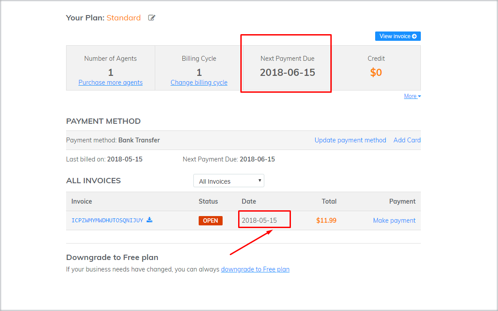
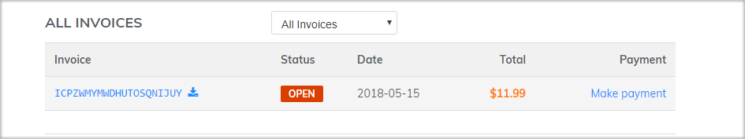
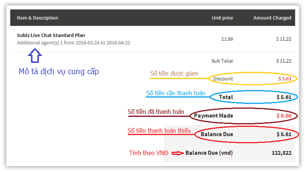

# FAQs

### Why I still receive message after paid?

This situation occurs in the case of payment due to a difference in balance when making the transfer. This has been noted immediately at the payment confirmation email from the system when making a payment update for your account. Please pay the exact amount the system provides.


If you have any questions regarding the invoice and payment, please send feedback to [billing@subiz.com](mailto:billing@subiz.com) for support.


### Why Payment via Credit Card failed?

#### Your credit card was declined


In the process of making a payment via credit card, a "declined card" error message can occur for a variety of reasons. Upon receipt of the payment order from you, our payment gateway immediately sends the request to the bank, your bank side has a system that automatically processes the request, and can either allow or Refusal to request payment.

Automatic processing system based on some signs from your account such as account balance, card spending habits, card information \(card holder name, card number, expiration date, CVC code \). These signs may vary, depending on your use of the card.

Even if you have made sure all card information is filled in correctly, and previous transactions have been successful, the next payment will be declined.

One of the reasons banks tighten this part of their payments is related to the risk of fraud \(for each bank\).

#### What the correct reason for "Card declined"?

Most of the information that banks offer is very general, so we can not provide the exact reason why your card was declined.

If all the information you filled is correct, you can contact the card issuer directly for a specific reason, and ask for future similar payments to be approved without need direct communication from you.

#### Alternatives

To complete the upgrade payment, you can choose one of the following options:

1. Use another credit card \(if applicable\)
2. Contact the card issuing bank and ask for payment opening

### Contract and Invoice \(for corporate customers\)

To submit your contract and invoice, please fill in the form and send it to [billing@subiz.com](mailto:billing@subiz.com).

Method of delivery: Express delivery via courier

Duration: **07 - 10 working days**


* The contract is made for subscribers with payment periods of 12 months or more.
* The invoice is issued at the request of the enterprise with a payment period of 03 months or more.
* Subiz's products are not subject to tax. The VAT portion of the invoice will be crossed out.


#### Late issue an invoice

The invoice is required to be made within 30 days from the date enterprise completes the payment obligation. [Subiz](https://subiz.com/en%20) is not responsible for billing if the time limit is exceeded. This policy is applicable to all [Subiz](https://subiz.com/en%20) customers.

### Invoice Management

To track your status, billing status \(billing status, period, residual term...\) you can access your [Subiz](https://app.subiz.com/subscription), go to [Settings &gt; Subscription](https://app.subiz.com/payment-home). The information will be displayed as follows:

### Refund Policy

#### Trial period

[Subiz ](https://subiz.com/en%20)allows you to try the full 30 days trial most of Subiz’s features. After 30 day trial, you may consider upgrading to a paid or a free[ Subiz ](https://subiz.com/en%20)package.

#### Paid accounts

When you decide to upgrade your account, you need to specify the agent \(s\), billing cycle, and service pack type. Payment will be completed at the beginning of the usage cycle. We do not have a refund policy - this is a policy for all customers - and you will be responsible for all payments for the account you own.

### What are Special Offers of Subiz?

* [Subiz](https://subiz.com/en%20) offers up to 30% discount on long cycle payments, see details in the pricing page.
* [Subiz](https://subiz.com/en%20) offers a 40% discount for any kind of public shools and non-governmental organization.

### Can I change the Subiz package at any time? {#can-i-change-the-subiz-package-at-any-time}

Yes, you can change your [Subiz ](https://subiz.com/en%20)plan at any time to suit your business situation. You can add / reduce agents, increase / decrease the billing cycle or change the payment method accordingly.

### Why does the system show the notice of overdue invoices? {#why-does-the-system-show-the-notice-of-overdue-invoices}

When your account creates an open invoice, the system will display a notification until you complete the payment. Click on "make payment" on the notification - the system will automatically take you to the Invoice List so that you can conveniently lookup the unpaid invoice and make a payment.

### My next payment date has not arrived yet, why are there still unpaid bills? {#my-next-payment-date-has-not-arrived-yet-why-are-there-still-unpaid-bills}

When your renewal date is expired, your system will automatically renew the next cycle and send you a notification. Therefore, the next payment date will display the end date of the new cycle. You need to check the details on the invoice to understand which time the service provides for.


In case of the unexpected invoice, you need to send a confirmation to [Subiz](https://subiz.com/en%20), we will help you cancel the invoice.


### Renewal Invoice {#renewal-invoice}

At the beginning of the next cycle, the system will automatically renew the service and the renewal invoice will be created accordingly.

[Subiz](https://subiz.com/en%20) will send a notification of account renewal via the following methods: Email to the account owner; Show notifications on the Dashboard management page; Show notifications in the New Alerts section.

When receiving the notice, you can check the invoice directly at the payment page as shown


* If your account is set up to make automatic payments via credit card, the system will automatically call for payment within 24 hours of the invoice date.
* If your account uses bank transfer, within 7 days the system will send an email to remind you about the renewal payment.


### What channels are overdue invoices notified? {#what-channels-are-overdue-invoices-notified}

Overdue invoices will be notified via the following channels:

* Show notifications on the Dashboard management screen
* Show notifications in the New Alerts section
* E-mail notification to register email \(default\), or email of the person in charge.


To ensure that you receive sufficient information from [Subiz](https://subiz.com/en%20), in case you change account manager or change contact email, you need to send confirmation to [Subiz](https://subiz.com/en%20) so that we can update your information.


### How to read the information on the Invoice? {#how-to-read-the-information-on-the-invoice}

The invoice is a certificate for providing the service from Subiz, you should actively know and control this information:

**Balance Due** is the amount of debt. When Balance due is greater than zero, the system will display a notice of overdue invoice.

