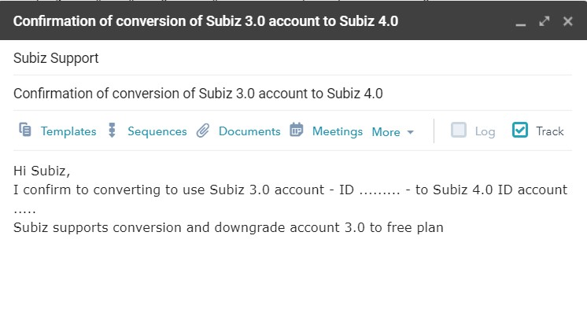

# FAQs

### Why I still receive message after paid?

This situation occurs in the case of payment due to a difference in balance when making the transfer. This has been noted immediately at the payment confirmation email from the system when making a payment update for your account. Please pay the exact amount the system provides.


If you have any questions regarding the invoice and payment, please send feedback to [billing@subiz.com](mailto:billing@subiz.com) for support.


### Why Payment via Credit Card failed?

#### Your credit card was declined


In the process of making a payment via credit card, a "declined card" error message can occur for a variety of reasons. Upon receipt of the payment order from you, our payment gateway immediately sends the request to the bank, your bank side has a system that automatically processes the request, and can either allow or Refusal to request payment.

Automatic processing system based on some signs from your account such as account balance, card spending habits, card information \(card holder name, card number, expiration date, CVC code \). These signs may vary, depending on your use of the card.

Even if you have made sure all card information is filled in correctly, and previous transactions have been successful, the next payment will be declined.

One of the reasons banks tighten this part of their payments is related to the risk of fraud \(for each bank\).

#### What the correct reason for "Card declined"?

Most of the information that banks offer is very general, so we can not provide the exact reason why your card was declined.

If all the information you filled is correct, you can contact the card issuer directly for a specific reason, and ask for future similar payments to be approved without need direct communication from you.

#### Alternatives

To complete the upgrade payment, you can choose one of the following options:

1. Use another credit card \(if applicable\)
2. Contact the card issuing bank and ask for payment opening

### Can I change the Subiz package at any time? 

Yes, you can change your [Subiz ](https://subiz.com/en%20)plan at any time to suit your business situation. You can add / reduce agents, increase / decrease the billing cycle or change the payment method accordingly.

### Why does the system show the notice of overdue invoices? 

When your account creates an open invoice, the system will display a notification until you complete the payment. Click on "make payment" on the notification - the system will automatically take you to the Invoice List so that you can conveniently lookup the unpaid invoice and make a payment.

### My next payment date has not arrived yet, why are there still unpaid bills? 

When your renewal date is expired, your system will automatically renew the next cycle and send you a notification. Therefore, the next payment date will display the end date of the new cycle. You need to check the details on the invoice to understand which time the service provides for.


In case of the unexpected invoice, you need to send a confirmation to [Subiz](https://subiz.com/en%20), we will help you cancel the invoice.


### How to read the information on the Invoice? 

The invoice is a certificate for providing the service from Subiz, you should actively know and control this information:

**Balance Due** is the amount of debt. When Balance due is greater than zero, the system will display a notice of overdue invoice.

### Convert to use Subiz 3.0 account to Subiz 4.0 

You have a Subiz version 3.0 account and want to use Subiz version 4.0. You need to do 2 steps:

#### Install the Subiz 4.0 account deployment:

Sign in to the Dashboard Subiz 4.0 via the app.subiz.com link with the email and account password you currently own. Note: If you want to use a new Subiz 4.0 account, you need to register a new account here.

Integrating chat window Subiz 4.0 on website, connecting Fanpage \(if any\) to Subiz \(See details\)

Automatic update using Automation to welcome visitors to the website \(See details\)

Chat and manage customer lists on Subiz \(See details\) 

#### Confirm to transfer to Subiz 4.0

Your Subiz 3.0 account is using a paid plan, you need to send an email to Support@subiz.com to confirm the account from Subiz 3.0 to Subiz 4.0 to ensure full benefits of using the paid service package.

* **Email sender:** Email address for managing Subiz 3.0 account
* **Receiver email:** Support@Subiz.com
* **Subject:** Confirmation of conversion of Subiz 3.0 account to Subiz 4.0
* **Content:** Converting to use Subiz 3.0 account - ID ......... - to Subiz 4.0 ID account ..... Subiz supports conversion and downgrade account 3.0 to free plan.

