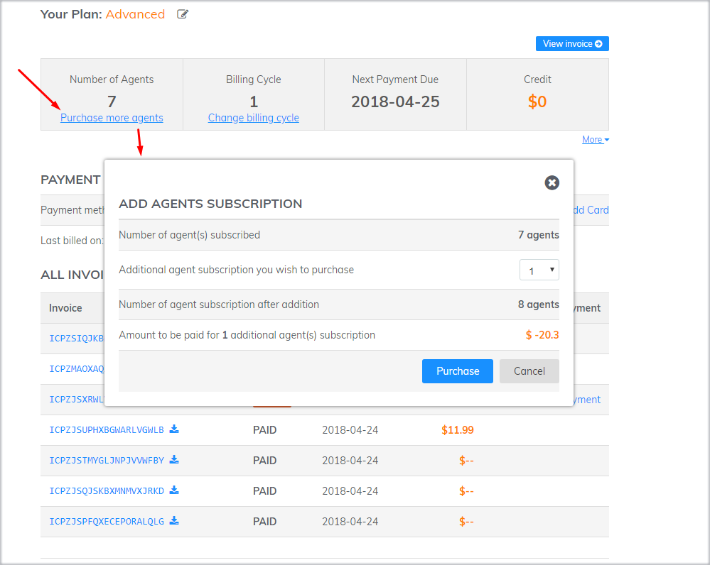

# How to change Subscription information?

During your payment period, you can change your subscription information at any time in order to match your needs.

### Upgrade your account

* **Upgrade from Free plan to Standard or Advanced plan**

If your account is in free plan, to upgrade your account, go to page [PAYMENT](https://app.subiz.com/payment-home) &gt; Choose a plan that fits you as Standard or Advanced &gt; Choose the number of Agents &gt; Select Billing Cycle, either monthly or yearly &gt; Click SUBSCRIPTION NOW to provide your credit card for payment.

* **Upgrade from a Standard plan to Advanced plan**

If you want to upgrade from Standard plan to Advanced plan, click **More** &gt; **Change Plan** &gt; Choose **Advanced** &gt; Select **UPGRADE NOW**


After upgrading your account, the system will create invoices in your account. You can choose to pay by Credit Card or by Bank Transfer


### Downgrade Account

* Downgrade account 

To downgrade your account, you click on **Your Plan**, and then click on **Downgrade** 

### Change number of Agents

**Purchase more Agents**

To add more agents, you can click on **Purchase more Agents** then select the number of additional agents.

**Reduce Agents**

To reduce Agents, you click on **More,** then select the number of agents to reduce.

### Change Billing Cycle

To change the billing cycle, you click on **Change billing cycle**, then select the suitable billing cycle.

### Downgrade to Free Package

Depend on your business situation, you can downgrade your account to free or upgrade at anytime.

### Update payment method

You can edit the payment's information such as adding another credit card, changing payment methods via  credit card or bank transfer, ... 

To update payment method, head to the page [PAYMENT](https://app.subiz.com/payment-home) and follow these steps:

* Use credit card to pay for Subiz subscription:  1. Click **Add card** &gt; Fill in your **credit or debit card** &gt; make sure you have already selected **Make Primary** &gt; Choose **Finish**. 2. Turn **ON** - **Auto Charge**

* Remove a credit card and pay via Bank transfer 1. Click **Update payment method** &gt; choose **Edit Credit Card** &gt; **Remove mark at Make Primary**. 2. Send email to **Support@Subiz.com** for bank account details provided by Subiz.


Note: Please feel free to contact us via email Support@Subiz.com for further support.


  

