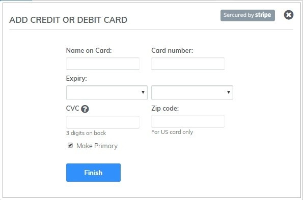
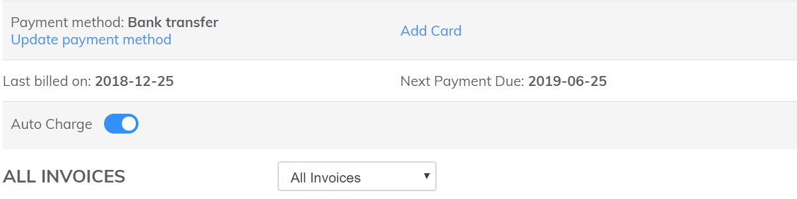

# Renewal Payment of Subiz

### What is the renewal of Subiz? 

Once your account ends the billing cycle of your service plan, Subiz will automatically support the renewal of your paid subscription service, avoiding disruption of your business. The term will also automatically be generated for you to make a payment. You can view the invoice and service package details at the [PAYMENT](https://app.subiz.com/payment-home) of Subiz.

### Notification of renewal invoice

Notification of renewal invoice Subiz will announce the renewal invoice for payment via two channels:

* Notification in the your Subiz account - App.subiz.com, you can check the renewal invoice details at the PAYMENT page.
* Notification via the email of Agent owner or the one who in charge of your Subiz account you require receipt of a invoice notification. 

### Payment method of Subiz 

Currently, [Subiz ](https://subiz.com/en%20)supports 2 forms of payment: **Credit Card** and **Credit Transfer**. Upgrading your account to a paid service after you have experienced the trial period is extremely simple. Just a few minutes, your account will be upgraded immediately.

### Payment via Credit Card \(Credit and Debit card\)

If you have selected the Payment Method as Credit Card and turned on Auto Charge, within 24 hours of the invoice being issued, Subiz will charge the exact amount payable on the invoice. If you have not selected a payment method as a credit card, you need to do the following 3 steps: 

**Step 1:** Access Subiz Payment's page for check invoices you have to pay. 

**Step 2:** choose SUBSCRIBE NOW. Account will be upgraded and self generated invoice. To make a payment via credit card, select Add card&gt; Fill out credit or debit card information&gt; Choose Make Primary&gt; Complete 

**Step 3:** On - Auto Charge

### Payment via Bank Transfer

You will go to PAYMENT&gt; Open Bill Payout Invoice to view payment and transfer information to:

* Account number: 0451001477880 At Bank for Foreign Trade of Vietnam - Thanh Cong Branch - Hanoi 
* Account holder: VietnamBIZ Online Solution JSC
* Transfer content: Purchase service for "Account ID" or "website" or "login email Subiz"


If you have any questions and need further assistance, please send a request to Support@Subiz.com


  

