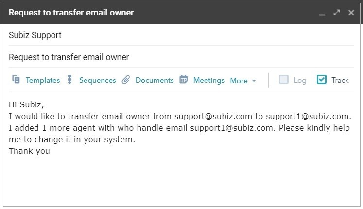

# Manage email owner

Subiz account is the property of the business, so when registering Subiz, businesses need to manage their account including registration email, password to ensure the rights to use Subiz service and data security of enterprise. Refer to the following article to better understand Subiz account management.

### Subiz account 

#### Email Owner

When you register for a Subiz account, the registration email will be called the main account email or the owner email. The main account has the highest permissions and account management via email owner. Include rights:

* Sign in to the Subiz’s Dashboard via App.subiz.com.
* Manage account information of the account: upgrade, buy agent, renewal service, payment method.
* Manage Agent accounts: Create more, customize permissions, delete Agent accounts.
* Make edits, account settings.
* Email owner is the main email for Subiz to contact support and send important notification emails


Note: 

* You should register for a Subiz account with the company's general email to make it easier to manage your account during the course of your work, to avoid registering by personal email, misplacing your business rotation, and handing over your account. 
* Only the account owner email owner has the right to manage the account and send a request to Subiz about account issues: transfer payment to another account, change the owner email ...
* You can change your email to receive renewal information from Subiz by contacting Subiz for support to changing this email.


#### Password

Password is confidential information of the business. Password will be encrypted security and managed by the business

In case of forgetting the password you can restore it by clicking on the forgotten password section on the Subiz login page. The system will send your registration email to instruct you to change your password.

### Example about cases need to change Email owner

* The email owner is no longer working at the company.
* Email account is no longer available.
* There is doubt about account security

### Instructions for changing Email Owner 

**During working time, if you want to change the email owner you can do the following:**

1. Where the owner email is still active and usable

* Create new Agent in account with new email owner.
* You log in to the initial registration email and send an email to Support to request the exchange of the owner email, providing a new email owner. Subiz will assist you in manipulating the conversion. 

2. In case the email is inactive, unusable

* If the enterprise has signed a contract with Subiz: You send the contract with the Appendix to request to change the email owner with the seal of the business.
* In case of no contract: Enterprises need to register a new account and re-integrate on the website.

In addition to the above cases, Subiz will not support the change of email owner to ensure the rights of using and securing the information of enterprises. Therefore, businesses should pay attention to be able to manage Subiz account in a systematic way to avoid interruption in account verification process and improve information security.

