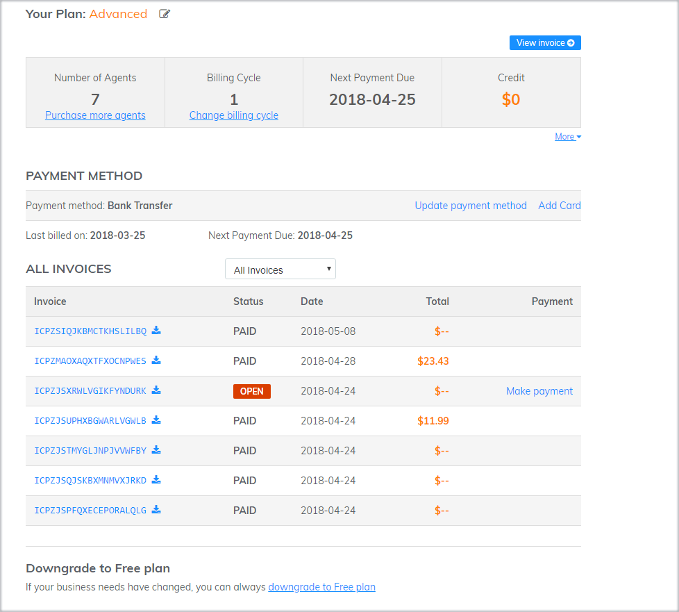

# Checking current account

When working with Subiz, to manage your package information including package type, billing cycle, number of agents ... you can check and make changes at the payment page.

The payment page includes the following information:  

* **Package type:** The information of your current package : Free, Trial, Standard, Advanced Free: Free Package Trial: Your account is under trial Standard: Basic Package Advanced: Advanced Package Number of Agents: The number of agent \(s\) activated for your account 
* **Payment cycle:** Short or long term payment cycles will allow you to easily control the subscription period for your account \(1 month / 3 months / 6 months / 1 year / 2 years\) 
* **Next billing date:** The exact date of payment will help you plan for your next billing cycle. 
* **Credit:** It exists in your account as a fundraiser. You can use to pay at any time, for any bill you choose. Note: Payment amount should be equivalent. 
* **Current payment method:** Bank Transfer or Credit Card. You can flexibly change this payment method at any time. 
* **Invoice list:** All  invoices and payment status of these invoices will be displayed. You can easily control the payment and download for the process of sharing or storage. 


Note: Only the Agent Owner or Agent is allowed full access to account settings can access the payment page.  


