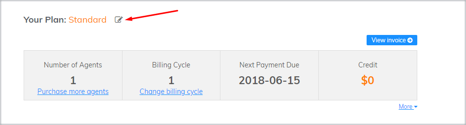
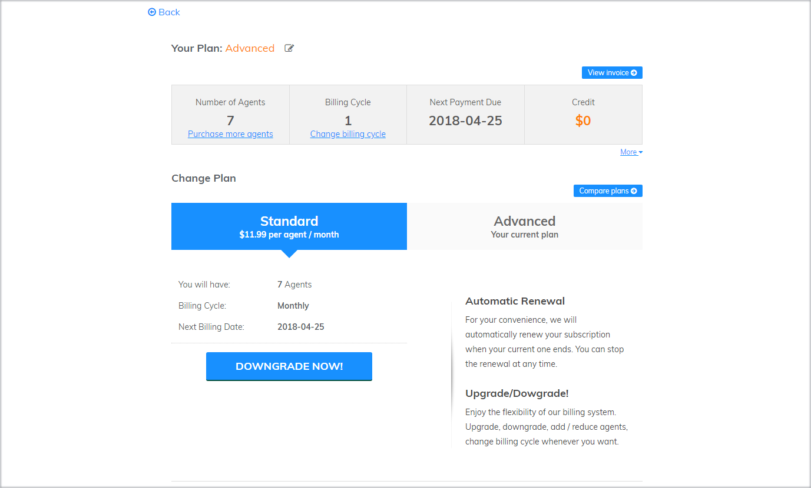

# How to change pricing packages?

When using Subiz, depending on your business situation and development strategy, you can change your account information at any time to suit your needs.

### Upgrade/ Downgrade Account 

#### Upgrade Account {#nang-cap-tai-khoan}

* **Free Plan to Paid Plan**

If your account is free, and you want to upgrade to a paid plan, you need to log in your [Payments page](https://app.subiz.com/payment-home), then select the appropriate Agent number and cycle, and click on **Subscribe Now**   

* **Standard Package to Advanced Package**

If you want to upgrade the Basic package to the Advanced package, click on **Your Plan** 

Then you select Advanced Plan and click on Upgrade Now


 After upgrading your account, the system will create invoices in your account. You can choose to pay by Credit Card or by Bank Transfer


#### Downgrade Account {#ha-cap-tai-khoan}

To downgrade your account, you click on Your Plan, and then click on Downgrade 

### Change number of Agents

**Purchase more Agents**

**Reduce Agents**

### Change Billing Cycle

### Downgrade to Free Package

