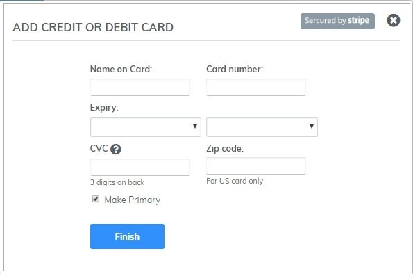

# Pay Service Plan for Subiz

You are fully active in upgrading the Subiz service package and making a payment right on the PAYMENT of Subiz

Subiz supports 2 methods of payment: Credit Card and Bank Transfer. Just a few steps, your account will be upgraded immediately. 

### Payment via Credit Card \(Credit and Debit card\) 

**Step 1:** Access your Subiz account, go to Settings &gt;Payment. 

**Step 2:** Select the package information

* Standard or Advanced Plan
* Agent Number
* Billing cycle

**Step 3: C**hoose  SUBSCRIBE NOW. Account will be upgraded and self generated invoice.

**Step 4:** To make a payment via credit card, select Add card&gt; Fill out credit or debit card information&gt; Choose Make Primary&gt; Complete

**Step 5:** On - Auto Charge


**Note:** 

* The invoice that has been successfully billed will automatically update the status of PAID.
* In situation, payment via credit card by an error / non-payment , which you check in three steps:  - Check all steps: ON - Auto charge, Fill out credit card information.  - If you have done enough and correct information, please contact the bank check transaction error due to card limit or system error. - Contact with Subiz via email at Support@subiz.com or chat online at Subiz.com


### Payment via Bank Transfer 

**Step 1:** Access your Subiz account go Settings&gt; Payment. 

**Step 2:** Select the package information

* Standard or Advanced Plan 
* Agent Number 
* Billing cycle 

**Step 3:** Choose **SUBSCRIBE NOW**. Account will be upgraded and self generated invoice. 

**Step 4:** Open Bill Payment Invoice to view payment and transfer information to:

Account number: 0451001477880

At Bank for Foreign Trade of Vietnam - Thanh Cong Branch - Hanoi  
Account holder: VietnamBIZ Online Solution JSC 

Transfer content: Purchase service for "Account ID" or "website" or " email owner of Subiz".


**Note:**

* The invoice that has been successfully billed will automatically update the PAYMENT status.
* Need more support from Subiz, please contact your support@subiz.com email or chat online at Subiz.com.


