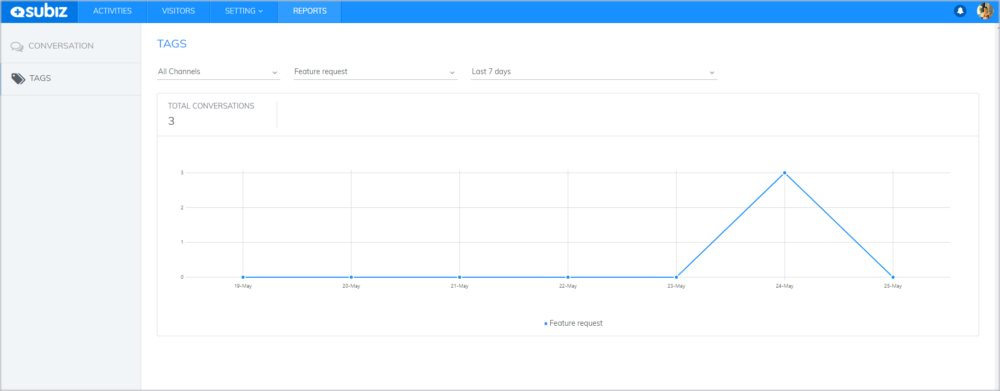
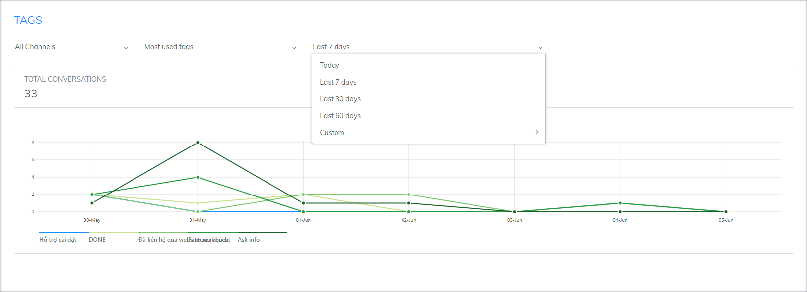
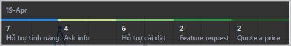

# Report of Tagged conversations

Subiz Tag is a feature that allows users to tag the interactions on all channels integrated [Subiz](https://subiz.com/en%20). The purpose of this feature is to help agents easily manage and categorize customer interactions such as: Support, Sales, Promotions...

Thanks to this function you can manage interactions according to their content and evaluate the effectiveness of the promotion. For example, your website is running a "Golden Week" promotion. After 7 days, you can statistically count how many interactions are tagged "quote a price", "successful deal"... These statistics will help you valuate the effectiveness of the promotion.

#### Report criteria

You can count the Tags according to Channels, Tags and Time



Select the channels that you want to filter tagged messages:




You can count tagged messages according to a specific tag or most used tags.

* According to most Used Tags: 5 tags

* According to a specific tag




You can select the time that you want to count tagged messages




#### How to read report charts

After selecting the report criteria, the data will be displayed as a chart

* **Vertical axis:** Number of Tags
* **Horizontal axis:** Time axis \(unit of time: date or hour depending on the time period you choose\)

At each intersection, you can see the number of tagged messages  per specific tag at a given time. This will help you manage the interaction more conveniently

For Example: 5 most used Tags in 19th April:

