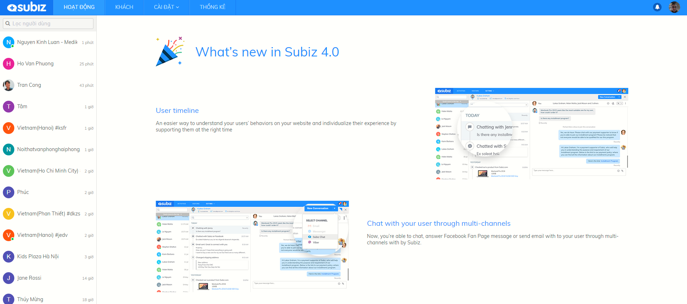

# How Subiz works?

### How Subiz works?

Businesses can reach and manage customers on multiple channels right on Subiz's Dashboard.

Here, you can track where customers are coming from, start interacting and pursuing customers from the Website, Facebook, Email, Zalo, …

Businesses can increase customer conversion rates and sales by:

* Gathering customer information and implement automated marketing strategies with **Automation**
* Segmenting and managing your leads through **Segment**
* Delivering conversations to Agents through **Rule**

### **Terms and definitions** {#Subizterm}

Below is definitions of common terms used in Subiz, that you need to understand accurately.

| **Agent** | Who sign in Subiz account to make interaction with customers, or set up and manage account. Agent can be manager, supporter or any person in your staff. |
| --- | --- | --- | --- | --- | --- | --- | --- |
| **Visitor** | Who visit your website |
| **User** | Who visit your website and connect you via Subiz |
| **Conversation** | Conversation among Agents and Users in any channel |
| **Channel** | The channel you use to interact with customers: Subiz Chat, Email, Messenger, Zalo … |
| **Rule** | Use rule to automatically assign incoming message to specific agent\(s\) or team. |
| **Segment** | Segment is a subset of users defined by condition\(s\) |
| **Automation** | Auto message or action sent based on certain conditions |

