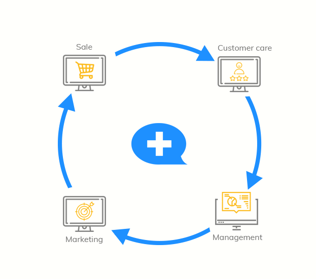

# What is Subiz?

### What is Subiz?

Subiz is a communication customer platform that brings high revenue.

Businesses can interact with their customers right on Subiz. Interactive data which is aggregated on Subiz will help you understand the customer personas and implement interactive marketing strategies for customer care and retention effectively.

### Benefits and Values of Subiz

Consumers often look for information and have demand for your brand on Website, Facebook, Email, ... at any time, so you can use Subiz to:

* **Improving the quality of customer service**: Always ready to support customers anytime, anywhere; speed up the response and get the history of conversations with customers.
* **Optimizing marketing capabilities:** Segment leads automatically and send automated email marketing to the right target customers.
* **Improving customer conversion rates:** Capture the needs of users, proactively reach and increase sales opportunities.
* **Managing customer data effectively:** Integrate customer interaction history and resolve customer support issues accurately.

As such, Subiz is all you need to interact and manage customers without using other applications. All done right on Subiz's Dashboard.

