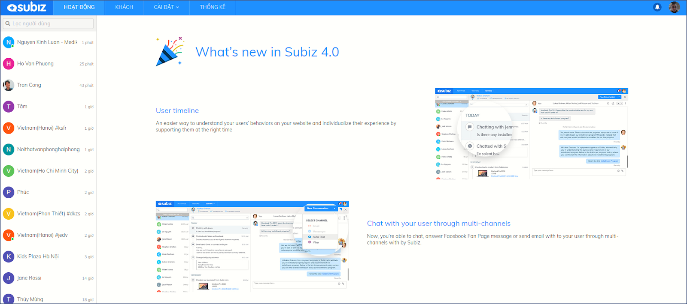

# Subiz overview

### What is Subiz?

[Subiz](https://subiz.com/en) is a communication customer platform that brings high revenue.

Business can interact with their customers right on [Subiz](https://subiz.com/en). Interactive data which is aggregated on [Subiz](https://subiz.com/en) will help you understand the customer personal and implement interactive marketing strategies for customer care and retention effectively.

### Benefits and Values of Subiz

Consumers often look for information and have demand for your brand on Website, Facebook, Email, ... at any time, so you can use [Subiz](https://subiz.com/en) to:

* **Improving the quality of customer service**: Always ready to support customers anytime, anywhere; speed up the response and get the history of conversations with customers.
* **Optimizing marketing capabilities:** Segment leads automatically and send automated email marketing to the right target customers.
* **Improving customer conversion rates:** Capture the needs of users, proactively reach and increase sales opportunities.
* **Managing customer data effectively:** Integrate customer interaction history and resolve customer support issues accurately.

As such, [Subiz](https://subiz.com/en) is all you need to interact and manage customers without using other applications. All done right on [Subiz's Dashboard](https://app.subiz.com).

### How Subiz works?

Subiz is a tool to support you reach, sell and manage your customers from multiple channels right on [Subiz's Dashboard](https://app.subiz.com).

Here, you can track where customers are coming from, actively interacting and pursuing customers on Website, Facebook, Email, Zalo, …

Businesses can increase customer conversion rates and sales by:

* Gathering customer information and implementing automated marketing strategies with **Automation**
* Segmenting and managing your leads through **Segment**
* Delivering conversations to Agents and managing Agent's activities through **Rule**

### **Terms and definitions** {#Subizterm}

As you're getting started on [Subiz](https://subiz.com/en), there are some common terms that are handy for you to know. Here's an overview of [Subiz](https://subiz.com/en) basics.

| **Agent** | Who sign in Subiz account to make interaction with customers, or set up and manage account. Agent can be a manager, supporter or any person in your staff. |
| --- | --- | --- | --- | --- | --- | --- | --- |
| **Visitor** | Who visit your website |
| **User** | Who visit your website and connect you via Subiz |
| **Conversation** | Conversation among Agents and Users in any channel |
| **Channel** | The channel you use to interact with customers: [Subiz Chat](https://subiz.com/live-chat.html), [Email](https://subiz.com/email.html), [Messenger](https://subiz.com/email.html), Zalo … |
| **Rule** | Use rule to automatically assign incoming message to specific agent\(s\) or team. |
| **Segment** | Segment is a subset of users defined by condition\(s\) |
| **Automation** | Auto message or action sent based on certain conditions |

